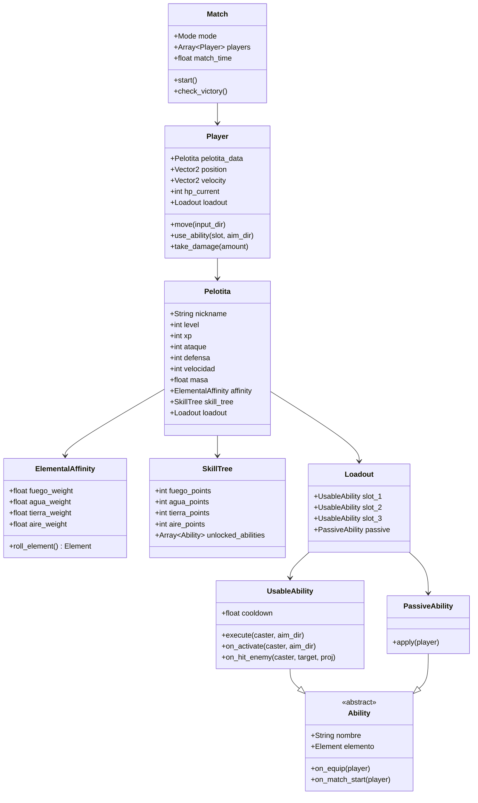
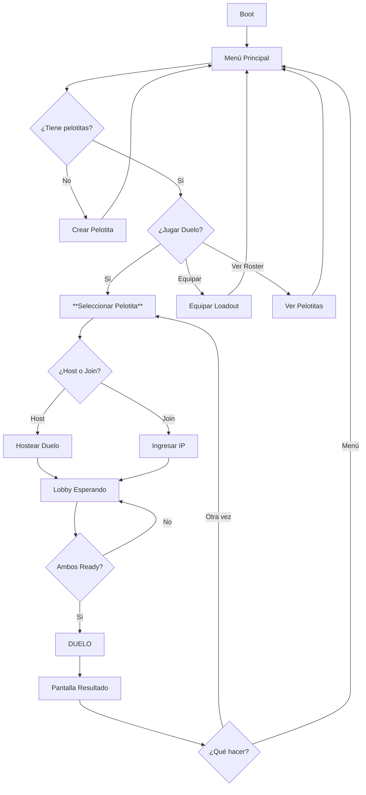
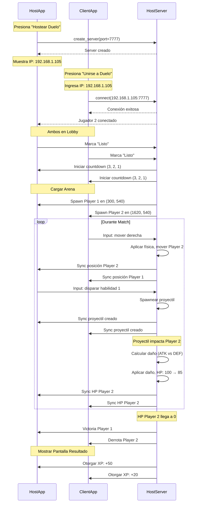
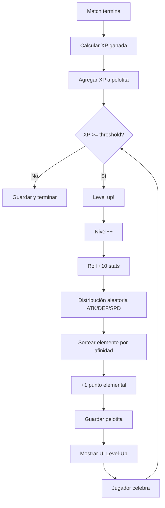

# Game Design Document - Pelotitas

**Versión**: 0.3 (MVP en desarrollo)  
**Fecha**: Septiembre 2026  
**Plataforma primaria**: Android móvil  
**Engine**: Godot 4.x  
**Género**: Action PvP - Batallas de pelotitas elementales

---

## ✅ Decisiones Locked Recientes (v0.3)

Las siguientes decisiones de diseño han sido **cerradas y locked** en esta versión:

### 1. Duelo por Vida - Timer y Victoria por Timeout ✅ CERRADO

- ✅ **Timer fijo de 3:00 minutos** (180 segundos)
- ✅ **Al acabar el tiempo**: Gana el jugador con **mayor HP actual**
- ✅ **HP igual al timeout**: **Empate** (sin ganador, no hay desempate adicional)
- ✅ Victoria por eliminación sigue funcionando (HP rival a 0)

**Implementación**:
```gdscript
const MATCH_DURATION: float = 180.0  # 3 minutos
```

**Estado**: ✅ CERRADO - No requiere más discusión

---

### 2. Sistema de Recursos: Solo Cooldowns, Sin Mana ✅ CERRADO

- ✅ **No hay sistema de mana/energía** en ningún momento del juego
- ✅ **Solo cooldowns fijos** por habilidad
- ✅ **Disparo básico**: Cooldown provisional de **1.0s** (sujeto a balance)
- ⚠️ Habilidades avanzadas: cooldowns intermedios (~3-5s) y ultimates (~10-15s) - valores exactos TBD balance

**Razón de diseño**: Simplicidad, ritmo de combate directo sin gestión de recursos

**Estado**: ✅ CERRADO - Arquitectura de habilidades confirmada

---

### 3. Obstáculos en Mapa - Comportamiento Completo ✅ CERRADO

**Propiedades de obstáculos** (confirmadas en v0.2, reforzadas en v0.3):
- ✅ **Indestructibles** (no tienen HP, no se pueden destruir)
- ✅ **Bloquean movimiento** de jugadores (StaticBody2D)
- ✅ **Bloquean proyectiles** (collision_mask incluye layer de proyectiles)

**Colisión Jugador vs Obstáculo** ✅ LOCKED:
- ✅ Jugadores **reciben daño** al impactar obstáculo a alta velocidad
- ✅ **Misma fórmula** que colisión con paredes:
  ```
  obstacle_damage = (impact_speed - WALL_DAMAGE_THRESHOLD) × WALL_DAMAGE_MULTIPLIER × masa
  ```
- ✅ Consistencia: impactar algo sólido a alta velocidad duele igual (pared u obstáculo)

**Colisión Proyectil vs Obstáculo** ✅ LOCKED:
- ✅ Proyectil **explota con VFX** elemental (partículas de color)
- ✅ Proyectil **desaparece** inmediatamente después de explosión (despawn)
- ✅ **Sin daño AoE**: La explosión es puramente visual, no daña jugadores cercanos
- ✅ Cover efectivo: esconderse detrás de obstáculo **bloquea completamente** proyectiles enemigos

**Estado**: ✅ CERRADO - Interacción completa definida

---

### 4. Roster de Pelotitas - Sistema Completo ✅ CERRADO

**Límites y Creación**:
- ✅ **Máximo 3 pelotitas gratuitas** en MVP (no más)
- ✅ **Crear nueva pelotita**: Solo requiere **nombre/nickname** (3-16 caracteres)
- ✅ **Masa fija**: Todas las pelotitas tienen `masa = 1.0` (no varía por nivel, roll, ni stats)
- ✅ **Stats iniciales**: Base 50 + roll aleatorio de +10 puntos entre ATK/DEF/SPD
- ✅ **Afinidades secretas**: Generadas aleatoriamente, nunca mostradas al jugador

**Borrado para Liberar Espacio**:
- ✅ **Roster lleno (3/3)**: Debe borrar 1 pelotita para crear nueva
- ✅ **Doble confirmación**: 
  1. Modal con stats completos + botón [Borrar]
  2. Input manual del nombre exacto para confirmar
- ✅ **Sin undo**: Borrado es permanente (archivo `.tres` eliminado)

**Selección Pre-Duelo**:
- ✅ **Obligatorio**: Antes de iniciar duelo, jugador **debe seleccionar 1 pelotita** del roster
- ✅ **Pantalla de selección**: Muestra cards con stats, nivel, récord (victorias/derrotas)
- ✅ **Progresión**: XP ganada en el match se asigna a la pelotita seleccionada

**Estado**: ✅ CERRADO - Sistema completo de roster definido

---

### 5. HP Scaling con Nivel ✅ CERRADO (provisional, tunable)

**Fórmula locked**:
```
max_HP = 100 + 10 × nivel
```

**Ejemplos**:
- Nivel 0: 100 HP
- Nivel 1: 110 HP
- Nivel 5: 150 HP
- Nivel 10: 200 HP (nivel máximo MVP)

**Características**:
- ✅ **Progresión lineal**: +10 HP por nivel
- ✅ **DEF independiente**: DEF solo afecta daño recibido, no HP máximo
- ⚠️ **Provisional**: Valores sujetos a balance y tuning en playtesting
  - Si peleas son muy largas → reducir a +8 HP/nivel
  - Si peleas muy cortas → aumentar a +15 HP/nivel
- ✅ **Impacto visible**: Diferencia tangible entre niveles (nivel 10 tiene 2× HP de nivel 0)

**Implementación**:
```gdscript
# En Player._ready()
hp_max = 100 + 10 * pelotita_data.level
hp_current = hp_max
```

**Estado**: ✅ CERRADO (provisional, sujeto a tuning)

---

### 6. Curvas de Progresión - Confirmadas ✅ CERRADO

**Ya estaban locked en v0.2, reconfirmadas en v0.3**:
- ✅ **Curva de XP exponencial**: `100 × 1.5^(n-1)` por nivel
- ✅ **Level cap inicial**: 10 (expansiones futuras +10 por tier)
- ✅ **XP por victoria**: Fórmula basada en diferencia de niveles (base 25, ±5 por diff, rango 5-65)
- ✅ **XP por derrota**: 0 XP en MVP

**Estado**: ✅ CERRADO (desde v0.2)

---

### ⚠️ Preguntas Abiertas Restantes

**Única pregunta de alta prioridad aún abierta**:

**Desconexión en Match** ⚠️ **ABIERTO**:
- ⚠️ ¿Qué pasa si un jugador se desconecta mid-match?
  - Opción A: match termina, desconectado pierde
  - Opción B: pausa 10s para reconectar
  - Opción C: AI toma control temporalmente
- **Impacto**: Experiencia de usuario, requiere decisión pronto

**Otras preguntas abiertas** (media/baja prioridad):
- Árbol de habilidades (cuántas por elemento, costos, dependencias)
- Lobby timeout y ready check

---

## 1. Visión y Pitch

### Visión

**Pelotitas** es un juego de acción PvP móvil donde los jugadores controlan pelotitas elementales en batallas tácticas top-down. Cada pelotita desarrolla su propia identidad a través de un sistema de progresión basado en **afinidades secretas** que determinan cómo evoluciona con el tiempo, combinado con distribución aleatoria de stats que asegura que no existan dos pelotitas idénticas.

### Pitch de 30 segundos

*"Crea tu pelotita elemental, descubre sus afinidades ocultas, y enfréntate en duelos rápidos donde cada habilidad lanza proyectiles de colores que colisionan en tiempo real. Cada pelotita es única — dos jugadores nivel 5 tendrán builds completamente diferentes basados en cómo el RNG y sus afinidades secretas moldearon su crecimiento."*

### Pilares de Diseño

1. **Identidad Emergente**  
   Cada pelotita desarrolla personalidad única a través de afinidades secretas (DinoRPG-style) y distribución aleatoria de stats. Los jugadores no controlan exactamente cómo crecen sus pelotitas, sino que descubren su identidad progresivamente.

2. **Combate Táctil y Reactivo**  
   Física de esferas 2D con inercia real. Colisiones elásticas entre jugadores, daño por impacto de pared, proyectiles con masa. El combate se siente físico y con peso.

3. **Accesibilidad Móvil-First**  
   Controles twin-stick optimizados para touch: palanca virtual + 3 botones con sistema press-hold-drag-release para apuntar. Diseñado primero para dedos, no para mouse.

4. **Modularidad Extrema**  
   Arquitectura plug-in para modos de juego, habilidades, y mecánicas. Agregar un modo nuevo (CTF, King of Hill) solo requiere una clase que hereda de `Mode`. Habilidades son Resources con triggers.

5. **Multijugador Sin Fricción**  
   MVP: host/join local WiFi con nickname solamente. Cero cuentas, cero login, cero servidores cloud. Dos amigos en la misma red pueden jugar en 15 segundos.

---

## 2. Plataformas y Tecnología

### Plataformas

| Plataforma | Estado | Prioridad | Notas |
|------------|--------|-----------|-------|
| **Android** | Primaria | P0 | Gama media/alta (Galaxy A, Redmi Note). Min SDK 24 (Android 7.0), Target SDK 34 |
| **Desktop (PC/Mac/Linux)** | Testing only | P1 | Standalone para desarrollo. Editor embebido come input, no usar |
| **iOS** | Futuro | P2 | Post-Android. Requiere Mac + provisioning |
| **Web (HTML5)** | Considerando | P3 | Posible para marketing/demo |

### Stack Tecnológico

- **Engine**: Godot 4.x (GDScript)
- **Networking**: ENet via Godot High-Level Multiplayer API
  - Host/join directo por IP local (WiFi)
  - Servidor autoritativo para física y daño
- **Resolución base**: 1920×1080 landscape
- **Física**: 2D integrada de Godot (CharacterBody2D, StaticBody2D)
- **Assets**: Placeholders programáticos (sprites: ColorRect con shape), futura transición a arte custom

### Por Qué Godot 4

- Motor 2D nativo potente (vs Unity que es 3D-first)
- GDScript rápido para iterar
- Export Android directo sin complicaciones
- High-Level Multiplayer API simplifica ENet
- Open-source y sin royalties

---

## 3. Core Loop

### Loop de Sesión (5-10 minutos)

```
Inicio app
   ↓
Menú Principal
   ↓
[Crear Pelotita] (solo primera vez o si no hay ninguna)
   ↓
Seleccionar Pelotita → Equipar Loadout (3 usables + 1 pasiva)
   ↓
Host o Join Duelo (ingresa IP host si join)
   ↓
DUELO (1-3 minutos de combate)
   ↓
Pantalla Resultado (ganador, XP ganada, level-up?)
   ↓
[Otra vez] → volver a Duelo  /  [Menú] → Menú Principal
```

### Loop de Progresión (sesiones múltiples)

```
Pelotita nivel N
   ↓
Jugar duelos → Ganar XP (por victoria - fuente principal)
   ↓
Alcanzar umbral XP → Level Up
   ↓
Recibir:
  • +10 puntos stats (ATK/DEF/Speed) distribuidos aleatoriamente
  • +1 punto de habilidad elemental (sorteo según afinidad secreta)
   ↓
Desbloquear/mejorar habilidades con puntos elementales
   ↓
Repetir hasta nivel máximo (cap inicial: 10)
   ↓
Esperar expansión de contenido (+10 niveles por tier)
```

### Loop de Match (micro, 1-3 min)

```
Spawn en arena → Moverse con palanca
   ↓
Apuntar habilidad (hold+drag botón) → Release para disparar proyectil
   ↓
Proyectil impacta enemigo → Daño calculado (ATK vs DEF) + knockback
   ↓
Enemigo empujado contra pared → Daño adicional por impacto
   ↓
Repetir hasta que HP de un jugador llegue a 0
   ↓
Victoria / Derrota
```

---

## 4. Entidades y Modelos de Datos

### Diagrama de Relaciones Principales



### 4.1 Pelotita (Datos Persistentes)

**Clase**: `PelotitaData` (Resource guardado en disco)

```gdscript
class_name PelotitaData extends Resource

## Identidad
@export var nickname: String = ""
@export var uuid: String = ""  # Generado al crear

## Progresión
@export var level: int = 0          # Nivel actual (0-10 en MVP, cap inicial)
@export var xp: int = 0             # XP acumulada para próximo nivel

## Stats de Combate (base)
@export var ataque: int = 50        # Base nivel 0
@export var defensa: int = 50       # Base nivel 0
@export var velocidad: int = 50     # Base nivel 0 (stat, no px/s)
@export var masa: float = 1.0       # Locked: fija en 1.0 para MVP

## Afinidad Elemental (Secreta, generada al crear)
@export var fuego_affinity: float = 0.0    # Suma total = 1.0
@export var agua_affinity: float = 0.0
@export var tierra_affinity: float = 0.0
@export var aire_affinity: float = 0.0

## Puntos de Habilidad Elemental (acumulados por level-ups)
@export var fuego_points: int = 0
@export var agua_points: int = 0
@export var tierra_points: int = 0
@export var aire_points: int = 0

## Habilidades Desbloqueadas (IDs o paths de Abilities)
@export var unlocked_ability_ids: Array[String] = []

## Loadout Equipado (paths a Resources de Ability)
@export var equipped_usable_1: String = ""
@export var equipped_usable_2: String = ""
@export var equipped_usable_3: String = ""
@export var equipped_passive: String = ""

## Metadata
@export var fecha_creacion: String = ""
@export var total_duelos: int = 0
@export var victorias: int = 0
@export var derrotas: int = 0
```

**Flujo de Creación de Pelotita** ✅ **COMPLETAMENTE LOCKED**:

**Input del jugador**:
- ✅ **Nombre/nickname** (único input requerido, 3-16 caracteres)
- ❌ **NO elige**: stats, color, elemento, apariencia

**Proceso automático del sistema**:
1. Validar nickname (único, longitud 3-16 caracteres)
2. Generar UUID único
3. Stats base: `ataque = 50, defensa = 50, velocidad = 50, masa = 1.0`
4. **Roll inicial**: +10 puntos distribuidos aleatoriamente entre ATK/DEF/SPD
   - Algoritmo: generar 3 enteros no negativos que sumen 10
   - Ejemplo: `[7, 2, 1]` → ATK=57, DEF=52, SPD=51
5. **Generar afinidades elementales secretas** (4 floats normalizados, suma = 1.0)
   - Ejemplo: `[0.38, 0.12, 0.28, 0.22]` → Fuego dominante (38%)
6. **Color visual**: derivado del elemento dominante de afinidad
   - Fuego dominante → tonos rojos/naranjas
   - Agua dominante → tonos azules
   - Tierra dominante → tonos marrones/verdes
   - Aire dominante → tonos blancos/celestes
   - ⚠️ El jugador NO ve las afinidades, solo el color visual resultante
7. Puntos elementales iniciales = 0 (se ganan en level-ups)
8. Habilidades desbloqueadas: 4 disparos básicos (uno por elemento)
9. Loadout inicial: 3 disparos básicos equipados + sin pasiva

**Resultado**: 
- Dos pelotitas creadas al mismo tiempo son **diferentes** (stats roll único)
- El jugador **descubre** la identidad de su pelotita a través del juego (colores, level-ups)
- UX simple: solo ingresa nombre, el resto es sorpresa controlada

**UI mockup**:
```
┌─────────────────────────────────┐
│     Crear Nueva Pelotita        │
├─────────────────────────────────┤
│                                 │
│  Nombre:                        │
│  [___________________]          │
│                                 │
│  (3-16 caracteres)              │
│                                 │
│  [Crear]  [Cancelar]            │
│                                 │
└─────────────────────────────────┘

↓ (después de crear)

┌─────────────────────────────────┐
│    ¡Pelotita Creada!            │
├─────────────────────────────────┤
│                                 │
│         ( ● )                   │
│       /  |  \                   │
│     Color: 🔴 Rojizo            │
│                                 │
│  "Chispa"                       │
│  Nivel 0                        │
│                                 │
│  Stats iniciales:               │
│    ATK: 57  DEF: 52  SPD: 51   │
│    Masa: 1.0                    │
│                                 │
│  [Jugar Duelo]  [Ver Pelotitas] │
└─────────────────────────────────┘
```

**Filosofía de diseño**: El jugador NO elige activamente la build de su pelotita, sino que la **descubre** a medida que juega y ve qué elemento domina en sus level-ups. Esto crea apego emocional ("mi pelotita resultó ser de Fuego") vs planificación fría.

### 4.2 Player (Entidad en Match)

**Clase**: `Player` (CharacterBody2D en `scenes/duel/player_prefab.tscn`)

```gdscript
extends CharacterBody2D
class_name Player

## Datos de la pelotita (cargados desde PelotitaData)
var pelotita_data: PelotitaData = null

## Stats efectivos en este match (calculados en spawn)
var ataque: int = 50
var defensa: int = 50
var max_speed_px_s: float = 200.0  # Calculado de velocidad stat + geometric mean
var masa: float = 1.0

## Estado de combate (✅ HP scaling locked - provisional)
var hp_max: int = 100  # ✅ LOCKED (provisional): Calculado como 100 + 10 × nivel
var hp_current: int = 100

## Física
const ACELERACION: float = 900.0   # px/s²
const FRICCION: float = 700.0      # px/s²

## Loadout (instancias de Ability cargadas al spawn)
var loadout: Loadout = null

## Red
@export var peer_id: int = 1  # ID de red del owner

func _ready():
    # Cargar datos de pelotita
    # ✅ LOCKED (provisional): Calcular HP máximo basado en nivel
    hp_max = 100 + 10 * pelotita_data.level
    hp_current = hp_max
    # Calcular max_speed_px_s basado en geometric mean del match
    # Instanciar loadout y llamar on_equip/on_match_start
    pass

func _physics_process(delta):
    # Aplicar input (movimiento con inercia)
    # Detectar colisiones (jugador-jugador, jugador-pared)
    # Llamar triggers de loadout
    pass

func use_ability(slot: int, aim_direction: Vector2):
    loadout.try_use_ability(slot, self, aim_direction)

func take_damage(amount: int):
    hp_current -= amount
    if hp_current <= 0:
        die()
```

### 4.3 Ability (Habilidades)

**Clase base**: `Ability` (Resource)

```gdscript
class_name Ability extends Resource

@export var ability_name: String = "Unknown"
@export var elemento: Element = Element.NEUTRAL  # Enum: FUEGO, AGUA, TIERRA, AIRE, NEUTRAL
@export var descripcion: String = ""

## Triggers (hooks de eventos)
func on_equip(player: Player) -> void:
    pass  # Llamado al equipar en loadout

func on_match_start(player: Player) -> void:
    pass  # Llamado al inicio del match

## Solo UsableAbility implementa estos
func on_activate(caster: Player, aim_direction: Vector2) -> void:
    pass

func on_hit_enemy(caster: Player, target: Player, projectile: Node2D) -> void:
    pass

## Solo pasivas implementan este
func apply(player: Player) -> void:
    pass
```

**Subclases**:
- `UsableAbility`: tiene cooldown, método `execute(caster, aim_dir)` que spawnea proyectiles
- `PassiveAbility`: efecto permanente aplicado en `on_match_start`

**Ejemplo: Disparo Elemental Básico**

```gdscript
# res://scripts/abilities/implementations/elemental_shot.gd
class_name ElementalShot extends UsableAbility

@export var projectile_scene: PackedScene  # projectile_elemental.tscn
@export var projectile_speed: float = 400.0  # px/s
@export var projectile_lifetime: float = 3.0
@export var cooldown_time: float = 1.0  # Locked provisional: 1.0s para disparos básicos

func execute(caster: Player, aim_direction: Vector2) -> void:
    var proj = projectile_scene.instantiate()
    proj.position = caster.position
    proj.velocity = aim_direction.normalized() * projectile_speed
    proj.damage = caster.ataque  # El proyectil porta el ATK del caster
    proj.source_player = caster
    proj.source_ability = self
    proj.lifetime = projectile_lifetime
    get_tree().current_scene.add_child(proj)
```

### 4.4 Projectile (Proyectiles)

**Clase**: `Projectile` (Area2D)

```gdscript
extends Area2D
class_name Projectile

var velocity: Vector2 = Vector2.ZERO
var damage: int = 10  # Daño bruto (ATK del caster)
var lifetime: float = 3.0
var source_player: Player = null
var source_ability: Ability = null

const KNOCKBACK_FORCE: float = 150.0  # px/s

func _ready():
    body_entered.connect(_on_body_entered)

func _physics_process(delta):
    position += velocity * delta
    lifetime -= delta
    if lifetime <= 0:
        queue_free()

func _on_body_entered(body):
    if body is Player and body != source_player:
        # Calcular daño (ATK vs DEF)
        var final_damage = max(1, damage - body.defensa * 0.5)
        body.take_damage(int(final_damage))
        
        # Aplicar knockback
        var knockback_dir = velocity.normalized()
        body.velocity += knockback_dir * KNOCKBACK_FORCE
        
        # Trigger on_hit_enemy
        if source_ability:
            source_ability.on_hit_enemy(source_player, body, self)
        
        # Despawn
        queue_free()
```

### 4.5 Mode (Modos de Juego)

**Clase base abstracta**: `Mode` (Resource o Node)

```gdscript
class_name Mode extends Node

func on_match_start(players: Array[Player]) -> void:
    pass  # Inicializar modo, spawnar jugadores

func check_victory_conditions(players: Array[Player]) -> int:
    return -1  # Retorna peer_id del ganador, -1 si no hay ganador aún

func on_player_death(player: Player) -> void:
    pass  # Manejar muerte de jugador

func get_spawn_positions() -> Array[Vector2]:
    return []  # Posiciones de spawn para este modo

func process_mode(delta: float) -> void:
    pass  # Lógica por frame específica del modo
```

**Ejemplo concreto: DueloPorVida** ✅ **LOCKED**

```gdscript
class_name DueloPorVida extends Mode

const MATCH_DURATION: float = 180.0  # ✅ LOCKED: 3:00 minutos (180 segundos)

var match_timer: float = 0.0

func check_victory_conditions(players: Array[Player]) -> int:
    # Victoria por eliminación
    var alive_players = players.filter(func(p): return p.hp_current > 0)
    if alive_players.size() == 1:
        return alive_players[0].peer_id
    
    # ✅ LOCKED: Victoria por timeout (3:00)
    if match_timer >= MATCH_DURATION:
        # Gana el jugador con mayor HP actual
        var player_1 = players[0]
        var player_2 = players[1]
        
        if player_1.hp_current > player_2.hp_current:
            return player_1.peer_id
        elif player_2.hp_current > player_1.hp_current:
            return player_2.peer_id
        else:
            # HP igual = empate
            return 0  # Código especial para empate
    
    return -1  # Match continúa

func process_mode(delta: float):
    match_timer += delta

func get_spawn_positions() -> Array[Vector2]:
    return [
        Vector2(300, 540),   # Izquierda
        Vector2(1620, 540)   # Derecha
    ]
```

### 4.6 Match (Instancia de Partida)

**Clase**: `Match` (scene `arena_duelo.tscn` con script `arena_duelo.gd`)

```gdscript
extends Node2D
class_name Match

var current_mode: Mode = null
var players: Array[Player] = []
var match_time: float = 0.0
var match_state: MatchState = MatchState.WAITING  # WAITING, ACTIVE, FINISHED

enum MatchState { WAITING, ACTIVE, FINISHED }

func _ready():
    current_mode = DueloPorVida.new()
    spawn_players()
    current_mode.on_match_start(players)
    match_state = MatchState.ACTIVE

func _process(delta):
    if match_state != MatchState.ACTIVE:
        return
    
    match_time += delta
    current_mode.process_mode(delta)
    
    var winner_id = current_mode.check_victory_conditions(players)
    if winner_id != -1:
        end_match(winner_id)

func end_match(winner_peer_id: int):
    match_state = MatchState.FINISHED
    # Mostrar pantalla de resultado
    # Otorgar XP (lógica TBD)
```

### 4.7 UserPrefs (Preferencias Locales)

**Clase**: `UserPrefs` (Resource guardado en `user://`)

```gdscript
class_name UserPrefs extends Resource

@export var last_selected_pelotita_uuid: String = ""
@export var player_nickname: String = "Jugador"  # Nickname de red por defecto
@export var master_volume: float = 1.0
@export var sfx_volume: float = 1.0
@export var music_volume: float = 1.0
@export var show_fps: bool = false

# ... otras preferencias UI/UX
```

---

## 5. Sistema de Stats y Progresión

### 5.1 Stats Base (Locked)

Cada pelotita tiene 4 stats principales:

| Stat | Nombre | Efecto | Unidad |
|------|--------|--------|--------|
| **ATK** | Ataque | Daño infligido por proyectiles | int (raw damage) |
| **DEF** | Defensa | Reducción de daño recibido | int (mitigation) |
| **SPD** | Velocidad | Multiplicador de velocidad de movimiento | int (stat abstract) |
| **Masa** | Masa | Peso en colisiones elásticas | float (kg ficticio) |

**Valores iniciales al crear pelotita (Locked)**:
- **Nivel 0 base**: ATK=50, DEF=50, SPD=50, Masa=1.0
- **Roll inicial**: +10 puntos distribuidos aleatoriamente entre ATK/DEF/SPD
  - Distribución completamente libre: puede ser [10,0,0], [0,10,0], [5,3,2], [4,3,3], etc.
  - Algoritmo: generar 10 enteros no negativos que sumen 10
  - Ejemplo: si roll devuelve [7, 1, 2] → ATK=57, DEF=51, SPD=52

**Resultado**: Una pelotita recién creada (nivel 0) tendrá stats en rango:
- ATK: 50-60
- DEF: 50-60
- SPD: 50-60
- Masa: 1.0 **(fija, locked para MVP)**

**Nota sobre Masa**: En MVP, masa es siempre 1.0 para todas las pelotitas en todo momento. No hay variación por nivel, roll, o stats. Solo habilidades pasivas futuras podrán modificar masa (ej: "Masa +20% durante 5s"). Esto simplifica balance y física para MVP.

**No hay dos pelotitas nivel 0 idénticas** (probabilidad astronómicamente baja de mismo roll).

### 5.2 Fórmulas de Combate (Locked)

#### Daño Final

```
Daño Final = max(1, ATK_atacante - DEF_víctima × 0.5)
```

- DEF reduce daño al 50% de su valor
- Daño mínimo garantizado: 1 HP
- Ejemplo: ATK=60, DEF=40 → Daño = max(1, 60 - 20) = 40

#### Velocidad de Movimiento (Geometric Mean System)

La velocidad en píxeles/segundo se calcula relativamente según todos los participantes del match:

**Paso 1: Media geométrica de velocidades**
```
G = (∏ SPD_i)^(1/n)
```
Donde `SPD_i` es el stat de velocidad de cada participante y `n` es el número total.

**Paso 2: Velocidad en metros virtuales por segundo**
```
speed_m_s = SPD_i / G
```
Una pelotita con `SPD = G` se mueve a exactamente 1.0 m/s.

**Paso 3: Conversión a píxeles**
```
speed_px_s = speed_m_s × PIXELS_PER_METER
```
Constante: `PIXELS_PER_METER = 200 px/m`

**Ejemplo (duelo 1v1)**:
```
Pelotita A: SPD = 60
Pelotita B: SPD = 50

G = (60 × 50)^0.5 = √3000 ≈ 54.77

A: speed_m_s = 60 / 54.77 ≈ 1.095 m/s → 219 px/s
B: speed_m_s = 50 / 54.77 ≈ 0.913 m/s → 183 px/s
```

**Ventajas**:
- Proporcional: jugador con doble SPD se mueve al doble
- Independiente de valores absolutos (funciona igual con 50-60 que con 500-600)
- Se recalcula por match según participantes

#### Inercia y Aceleración

El movimiento NO es instantáneo. El input del jugador define dirección deseada, y la pelotita acelera hacia ella:

```gdscript
const ACELERACION: float = 900.0  # px/s²
const FRICCION: float = 700.0     # px/s²

func _physics_process(delta):
    if input_direction.length() > 0:
        # Acelerar hacia dirección deseada
        var target_velocity = input_direction.normalized() * max_speed_px_s
        velocity = velocity.move_toward(target_velocity, ACELERACION * delta)
    else:
        # Aplicar fricción
        velocity = velocity.move_toward(Vector2.ZERO, FRICCION * delta)
    
    velocity = velocity.limit_length(max_speed_px_s)
    move_and_slide()
```

Resultado: movimiento con peso, no detención/arranque instantáneos.

#### Knockback

Cuando un proyectil impacta:
```gdscript
const KNOCKBACK_FORCE: float = 150.0  # px/s inicial

# En colisión
target.velocity += knockback_direction * KNOCKBACK_FORCE
```

Escalable en el futuro (ej: proporcional a masa del proyectil × velocidad).

#### Daño por Pared

Cuando una pelotita impacta una pared a alta velocidad:

```
if impact_speed > WALL_DAMAGE_THRESHOLD:
    wall_damage = (impact_speed - threshold) × WALL_DAMAGE_MULTIPLIER × masa

WALL_DAMAGE_THRESHOLD = 100.0 px/s
WALL_DAMAGE_MULTIPLIER = 0.02
```

**Ejemplo**:
- Masa=1.0, impacto a 300 px/s → daño = (300-100) × 0.02 × 1.0 = 4 HP
- Masa=1.5, impacto a 400 px/s → daño = (400-100) × 0.02 × 1.5 = 9 HP

**Táctica**: Empujar al rival contra la pared **o contra un obstáculo** causa daño adicional.

#### Daño por Colisión con Obstáculo (Locked)

✅ **Locked**: Obstáculos dañan jugadores usando **la misma fórmula** que paredes:

```
obstacle_damage = (impact_speed - WALL_DAMAGE_THRESHOLD) × WALL_DAMAGE_MULTIPLIER × masa
```

**Razón de diseño**: Consistencia. Si impactas algo sólido a alta velocidad, duele igual sea pared u obstáculo.

**Implementación**: Detectar `collision_layer == 2` (Obstacles) en `_physics_process` y aplicar `handle_obstacle_collision()`.

### 5.3 Sistema de Level-Up (Locked + TBD)

#### Mecánica de Level-Up (Locked)

Cada vez que una pelotita sube de nivel (del nivel N al N+1):

1. **+10 puntos de stats** distribuidos aleatoriamente entre ATK/DEF/SPD
   - Misma lógica que el roll inicial
   - Puede ser [10,0,0], [0,0,10], [3,4,3], etc.
   - Enteros no negativos que sumen exactamente 10

2. **+1 punto de habilidad elemental**
   - El elemento se determina por sorteo aleatorio según afinidades secretas
   - Si afinidades son Fuego=0.4, Agua=0.2, Tierra=0.1, Aire=0.3:
     - 40% chance → Fuego +1
     - 20% chance → Agua +1
     - 10% chance → Tierra +1
     - 30% chance → Aire +1

**Ejemplo de progresión**:
```
Pelotita "Chispa" (nivel 0 → nivel 1)
  Afinidad secreta: [Fuego: 0.35, Agua: 0.15, Tierra: 0.20, Aire: 0.30]
  
  Stats antes: ATK=57, DEF=51, SPD=52
  
  Level-up roll stats: [4, 3, 3]
  → ATK=61, DEF=54, SPD=55
  
  Level-up roll elemento: sorteo devuelve Aire (30% chance)
  → aire_points: 0 → 1
```

Después de 5 level-ups, "Chispa" podría tener:
- ATK=80, DEF=60, SPD=70 (distribucion aleatoria acumulada)
- Puntos: Fuego=2, Agua=1, Tierra=0, Aire=2 (según sorteos de afinidad)

#### XP y Thresholds (Locked + TBD)

**Locked**:
- **Fuente principal de XP**: ganar duelos (victoria)
- **Level cap inicial**: 10
  - Futuras expansiones subirán el cap en incrementos de +10 (nivel 20, 30, 40, etc.)
  - Cada expansión viene con nuevo contenido: habilidades, modos, mapas

**Curva de XP** (Locked):
- **Fórmula exponencial**: XP requerida para alcanzar nivel N desde N-1:
  ```
  XP_required(N) = round(100 × 1.5^(N-1))
  ```
- **Tabla de niveles**:

| Nivel | XP Requerida | XP Acumulada | Victorias (~25-30 XP avg) |
|-------|--------------|--------------|---------------------------|
| 1 | 100 | 100 | 4 |
| 2 | 150 | 250 | 6 |
| 3 | 225 | 475 | 8-9 |
| 4 | 338 | 813 | 13-15 |
| 5 | 507 | 1,320 | 18-21 |
| 6 | 760 | 2,080 | 28-32 |
| 7 | 1,141 | 3,221 | 43-50 |
| 8 | 1,711 | 4,932 | 65-76 |
| 9 | 2,566 | 7,498 | 100-116 |
| 10 | 3,849 | **11,347** | **150-176** |

**XP por victoria** (Locked - provisional, sujeto a balance):

**Fórmula basada en diferencia de niveles**:
```gdscript
diff = opponent_level - your_level

if diff >= 0:  # Oponente igual o más fuerte
    xp = min(25 + 5 * diff, 65)  # Base 25, +5 por nivel, cap en 65
else:  # Oponente más débil
    xp = max(5, 25 + 5 * diff)  # Mínimo 5 XP
```

**Ejemplos** (tu nivel = 5):
- vs nivel 5 (diff=0): 25 + 0 = **25 XP**
- vs nivel 6 (diff=+1): 25 + 5 = **30 XP**
- vs nivel 8 (diff=+3): 25 + 15 = **40 XP**
- vs nivel 10 (diff=+5): 25 + 25 = **50 XP**
- vs nivel 13+ (diff≥8): min(65, 65+) = **65 XP** (cap)
- vs nivel 4 (diff=-1): 25 - 5 = **20 XP**
- vs nivel 3 (diff=-2): 25 - 10 = **15 XP**
- vs nivel 1 (diff=-4): max(5, 5) = **5 XP** (mínimo)

**Características del sistema**:
- ✅ Incentiva enfrentar oponentes más fuertes (+5 XP por nivel arriba)
- ✅ Penaliza farming de jugadores débiles (hasta -5 XP, mínimo 5)
- ✅ Cap en +40 bonus (65 XP máximo) evita explotación de matchmaking
- ✅ Base de 25 XP para matchmaking justo (mismo nivel)
- ⚠️ Valores son provisionales y se ajustarán durante balance

**Estimación de progresión** (matchmaking balanceado, 50% WR):
- Con oponentes ±1-2 niveles: promedio ~25-30 XP por victoria
- Total victorias a nivel 10: ~400-450 victorias
- Total duelos con 50% WR: ~800-900 duelos

**XP por derrota**: 0 XP (en MVP)

**Out of MVP**:
- XP por participación (tiempo en match, daño infligido)
- XP por derrota (si se implementa post-MVP, será cantidad menor que victoria)

**Implementación**:
```gdscript
# scripts/core/progression.gd (Autoload)

const XP_PER_LOSS: int = 0  # MVP: sin XP por derrotas

func get_xp_required_for_level(level: int) -> int:
    # Curva exponencial: 100 × 1.5^(level-1)
    return int(round(100.0 * pow(1.5, level - 1)))

func calculate_win_xp(your_level: int, opponent_level: int) -> int:
    # Fórmula basada en diferencia de niveles
    var diff = opponent_level - your_level
    var xp = 0
    
    if diff >= 0:
        # Oponente igual o más fuerte: base 25 + bonus, cap en 65
        xp = min(25 + 5 * diff, 65)
    else:
        # Oponente más débil: penalización, mínimo 5
        xp = max(5, 25 + 5 * diff)
    
    return xp

func award_xp_for_match(pelotita: PelotitaData, won: bool, opponent_level: int) -> Dictionary:
    var xp_gained = 0
    if won:
        xp_gained = calculate_win_xp(pelotita.level, opponent_level)
    else:
        xp_gained = XP_PER_LOSS
    
    pelotita.xp += xp_gained
    
    var level_ups = []
    while pelotita.level < get_max_level() and pelotita.xp >= get_xp_required_for_level(pelotita.level + 1):
        pelotita.xp -= get_xp_required_for_level(pelotita.level + 1)
        pelotita.level += 1
        apply_level_up(pelotita)
        level_ups.append(pelotita.level)
    
    return {
        "xp_gained": xp_gained,
        "level_ups": level_ups,
        "capped": pelotita.level >= get_max_level()
    }
```

### 5.4 Sistema de Afinidad Elemental (Locked)

#### Generación de Afinidades (al crear pelotita)

Las afinidades son 4 pesos aleatorios que suman 1.0, representando la predisposición oculta de la pelotita hacia cada elemento.

**Algoritmo**:
```gdscript
func generate_affinity() -> Array[float]:
    var weights = []
    var sum = 0.0
    
    # Generar 4 valores aleatorios positivos
    for i in range(4):
        var r = randf_range(0.1, 1.0)  # Evita pesos de exactamente 0
        weights.append(r)
        sum += r
    
    # Normalizar para que sumen 1.0
    for i in range(4):
        weights[i] /= sum
    
    return weights  # [fuego, agua, tierra, aire]
```

**Resultado ejemplo**:
```
Pelotita A: [0.38, 0.12, 0.24, 0.26]  # Fuerte en Fuego
Pelotita B: [0.22, 0.31, 0.18, 0.29]  # Balanceada con leve preferencia Agua/Aire
```

#### Sorteo de Elemento en Level-Up

```gdscript
func roll_element_from_affinity(affinity: Array[float]) -> Element:
    var roll = randf()  # 0.0 - 1.0
    var cumulative = 0.0
    
    cumulative += affinity[0]
    if roll < cumulative: return Element.FUEGO
    
    cumulative += affinity[1]
    if roll < cumulative: return Element.AGUA
    
    cumulative += affinity[2]
    if roll < cumulative: return Element.TIERRA
    
    return Element.AIRE
```

#### Secreto: Nunca Mostrado al Jugador

Las afinidades exactas **nunca** se muestran en UI. El jugador solo descubre la tendencia de su pelotita a través de level-ups:

*"Mmm, mi pelotita ya ganó 4 puntos de Fuego y solo 1 de Agua en 5 level-ups... ¿será que tiene alta afinidad a Fuego?"*

Esto crea **identidad emergente** — el jugador no controla directamente el build, sino que lo descubre.

### 5.5 Skill Tree y Habilidades (Locked + TBD)

#### Puntos de Habilidad Elemental

Cada pelotita acumula puntos en 4 categorías:
- `fuego_points`
- `agua_points`
- `tierra_points`
- `aire_points`

Estos puntos se gastan para:
1. **Desbloquear habilidades nuevas**
2. **Mejorar habilidades existentes** (ej: cooldown -10%, daño +15%)

#### Estructura de Skill Tree (TBD - Hay que definir)

**Locked**:
- Habilidades básicas (disparo elemental de cada elemento) están desbloqueadas desde nivel 0
- Habilidades avanzadas requieren gastar puntos elementales
- Habilidades pueden tener dependencias (ej: "Muro de Tierra II" requiere "Muro de Tierra I" desbloqueado)

**TBD**:
- ¿Cuántas habilidades por elemento? (sugerencia: 5-8 por elemento en MVP)
- ¿Costo en puntos de cada habilidad? (sugerencia: básicas=0, intermedias=2-3, avanzadas=5-7)
- ¿Habilidades híbridas (requieren puntos de dos elementos)?
- ¿Refunds de puntos o son permanentes?

**Ejemplo de árbol parcial (Fuego)**:
```
Disparo de Fuego (Basic Shot)
  Costo: 0 (desbloqueado desde inicio)
  Cooldown: 1.0s
  Daño: ATK × 1.0
  
Bola de Fuego (Fireball)
  Costo: 2 puntos Fuego
  Cooldown: 3.0s
  Daño: ATK × 1.5, explosión en área (radio: 50px)
  Requiere: nivel 3+
  
Muro de Fuego (Fire Wall)
  Costo: 3 puntos Fuego
  Cooldown: 8.0s
  Spawnea 3 proyectiles estacionarios que dañan al contacto
  Duración: 5s
  Requiere: nivel 5+
  
Invocar Salamandra (Fire Summon)
  Costo: 5 puntos Fuego
  Cooldown: 15.0s
  Invoca pelotita NPC que persigue enemigos por 10s
  Daño de summon: ATK × 0.6
  Requiere: Muro de Fuego desbloqueado, nivel 8+
```

**UI de Skill Tree**: Pantalla separada accesible desde menú, muestra árbol visual con dependencias (nodos conectados), indica qué habilidades están desbloqueadas/bloqueadas y cuántos puntos quedan disponibles.

---

### 5.6 Sistema de Caps de Nivel por Tiers (Locked)

**Filosofía**: La progresión se expande en tiers para mantener el contenido fresco y gestionable.

#### Tier System

| Tier | Level Cap | Contenido Asociado | Estado |
|------|-----------|-------------------|--------|
| **Tier 1 (MVP)** | Nivel 0-10 | 4 elementos × 4-6 habilidades básicas/intermedias, Duelo por Vida | MVP actual |
| **Tier 2** | Nivel 11-20 | +2-3 habilidades avanzadas por elemento, 1-2 modos nuevos, 2 mapas | Post-MVP |
| **Tier 3** | Nivel 21-30 | Ultimates elementales, 2 modos adicionales, 3 mapas | Expansión 1 |
| **Tier 4+** | +10 por tier | Elementos híbridos, modos complejos (Battle Royale), contenido premium | Largo plazo |

#### Mecánica de Level Cap

**MVP (Tier 1)**:
```gdscript
const MAX_LEVEL_TIER_1: int = 10

func can_level_up(pelotita: PelotitaData) -> bool:
    if pelotita.level >= MAX_LEVEL_TIER_1:
        return false  # Cap alcanzado, necesita expansión
    return pelotita.xp >= get_xp_required_for_level(pelotita.level + 1)
```

**UI cuando se alcanza cap**:
```
┌─────────────────────────────────┐
│      🏆 NIVEL MÁXIMO 🏆         │
├─────────────────────────────────┤
│  ¡Chispa alcanzó nivel 10!      │
│                                 │
│  Has completado Tier 1.         │
│                                 │
│  XP acumulada: 250 XP           │
│  (guardada para próxima         │
│   expansión)                    │
│                                 │
│  Próximamente: Tier 2           │
│  • Nivel cap → 20               │
│  • Habilidades avanzadas        │
│  • Nuevos modos de juego        │
│                                 │
│  [Continuar]                    │
└─────────────────────────────────┘
```

**Ventajas del sistema de tiers**:
- **Control de balanceo**: balance inicial con 10 niveles es más manejable que 50+
- **Contenido gestionable**: crear 16-24 habilidades para Tier 1 es factible; 100+ no
- **Retención de jugadores**: cada tier es un evento / expansión que trae jugadores de vuelta
- **XP acumulada**: jugadores que alcanzan cap siguen ganando XP que se aplicará al desbloquear Tier 2

#### Implementación Técnica

```gdscript
# scripts/core/progression.gd

# Constantes de tier (se actualizan con cada expansión)
const CURRENT_TIER: int = 1
const TIER_LEVEL_CAPS: Dictionary = {
    1: 10,
    2: 20,
    3: 30,
    # Futuras expansiones agregan más tiers
}

func get_max_level() -> int:
    return TIER_LEVEL_CAPS.get(CURRENT_TIER, 10)

func award_xp(pelotita: PelotitaData, amount: int) -> Dictionary:
    pelotita.xp += amount
    var level_ups = []
    var capped = false
    
    while pelotita.xp >= get_xp_required_for_level(pelotita.level + 1):
        if pelotita.level >= get_max_level():
            capped = true
            break  # No subir más, guardar XP para expansión
        
        pelotita.xp -= get_xp_required_for_level(pelotita.level + 1)
        pelotita.level += 1
        apply_level_up(pelotita)
        level_ups.append(pelotita.level)
    
    return {
        "level_ups": level_ups,
        "capped": capped,
        "overflow_xp": pelotita.xp if capped else 0
    }
```

**Nota importante**: XP ganada después de alcanzar el cap NO se pierde — se guarda en `pelotita.xp` y se aplicará automáticamente cuando se desbloquee el próximo tier.

---

## 6. Física y Combate

### 6.1 Sistema de Física 2D

#### Configuración de Godot

- **Modo de física**: 2D integrado de Godot
- **Unidades**: píxeles (1 unidad Godot = 1 px)
- **Gravedad**: deshabilitada (top-down, no hay arriba/abajo)
- **Collision layers**:
  - Layer 1: Jugadores
  - Layer 2: Proyectiles
  - Layer 3: Paredes/obstáculos
  - Layer 4: Áreas especiales (futura: zonas de captura, power-ups)

#### CharacterBody2D para Jugadores

Los jugadores usan `CharacterBody2D` con `move_and_slide()`:

```gdscript
extends CharacterBody2D

func _physics_process(delta):
    # Aplicar input → aceleración → velocity
    # move_and_slide() maneja colisiones automáticamente
    var collision = move_and_slide()
    
    # Detectar colisiones post-move
    for i in get_slide_collision_count():
        var col = get_slide_collision(i)
        if col.get_collider() is Player:
            handle_player_collision(col)
        elif col.get_collider() is StaticBody2D:
            handle_wall_collision(col)
```

#### Colisiones Elásticas entre Jugadores

Cuando dos jugadores colisionan:

```gdscript
func handle_player_collision(collision: KinematicCollision2D):
    var other = collision.get_collider() as Player
    if not other: return
    
    var normal = collision.get_normal()
    var relative_velocity = velocity - other.velocity
    var impulse_magnitude = relative_velocity.dot(normal)
    
    if impulse_magnitude > 0: return  # Ya separándose
    
    # Colisión elástica (e=1.0)
    var impulse = -(1.0 + 1.0) * impulse_magnitude / (1.0/masa + 1.0/other.masa)
    var impulse_vector = normal * impulse
    
    velocity += impulse_vector / masa
    other.velocity -= impulse_vector / other.masa
    
    # Trigger para habilidades
    loadout.trigger_on_collide_player(self, other)
```

**Resultado**: jugadores rebotan entre sí sin causar daño directo. Mayor masa empuja más.

#### Colisiones con Paredes

Las paredes son `StaticBody2D`:

```gdscript
func handle_wall_collision(collision: KinematicCollision2D):
    var impact_speed = velocity.length()
    
    if impact_speed > WALL_DAMAGE_THRESHOLD:
        var damage = (impact_speed - WALL_DAMAGE_THRESHOLD) * WALL_DAMAGE_MULTIPLIER * masa
        take_damage(int(damage))
        # VFX de impacto
    
    # Trigger para habilidades
    loadout.trigger_on_collide_wall(self, collision.get_position(), collision.get_normal())

func handle_obstacle_collision(collision: KinematicCollision2D):
    # ✅ LOCKED: Obstáculos dañan igual que paredes (misma fórmula)
    var impact_speed = velocity.length()
    
    if impact_speed > WALL_DAMAGE_THRESHOLD:  # Mismo threshold
        var damage = (impact_speed - WALL_DAMAGE_THRESHOLD) * WALL_DAMAGE_MULTIPLIER * masa
        take_damage(int(damage))
        # VFX de impacto (puede ser visualmente distinto de pared)
    
    # Obstáculos también pueden triggerear habilidades
    loadout.trigger_on_collide_wall(self, collision.get_position(), collision.get_normal())
```

### 6.2 Proyectiles

#### Tipos de Proyectiles

Por ahora, proyectiles son `Area2D` con movimiento rectilíneo:

```gdscript
extends Area2D
class_name Projectile

var velocity: Vector2
var lifetime: float = 3.0
var damage: int = 10
var pierce: bool = false  # Si atraviesa o despawnea al impactar

func _physics_process(delta):
    position += velocity * delta
    lifetime -= delta
    if lifetime <= 0:
        queue_free()

func _on_body_entered(body):
    if body is Player:
        apply_hit(body)
        if not pierce:
            queue_free()
```

#### Colisión Proyectil-Jugador

```gdscript
func apply_hit(target: Player):
    # Calcular daño
    var final_damage = max(1, damage - target.defensa * 0.5)
    target.take_damage(int(final_damage))
    
    # Aplicar knockback
    var knockback_dir = velocity.normalized()
    target.velocity += knockback_dir * KNOCKBACK_FORCE
    
    # Trigger on_hit_enemy de la habilidad source
    if source_ability:
        source_ability.on_hit_enemy(source_player, target, self)
    
    # VFX de impacto (explosion sprite/particles)
    spawn_impact_vfx()
```

### 6.3 Arena y Mapa

#### Dimensiones (Locked)

- **Resolución base**: 1920×1080 px (landscape)
- **Paredes**: rectángulos de 20px de grosor en los 4 bordes
- **Área jugable**: 1880×1040 px interior

#### Primer Mapa: "Arena de Pilares" (Locked para MVP)

**Diseño confirmado**:
- ✅ **Paredes perimetrales**: 4 bordes sólidos (daño por impacto activado)
- ✅ **Obstáculos fijos**: Bloqueadores estáticos dentro del arena
  - Forma: rectángulos o círculos (TBD implementación)
  - Cantidad: 4-6 obstáculos (distribuidos simétricamente)
  - Posición: diseñados para crear cover y líneas de sight interesantes
  - Tipo: `StaticBody2D` con `CollisionShape2D`

**Layout sugerido** (simétrico para fairness):
```
┌─────────────────────────────────────────┐
│ Pared Superior                          │
│                                         │
│   P1        ▄▄▄      ▄▄▄        P2     │
│  spawn      ███      ███      spawn    │
│             ▀▀▀      ▀▀▀               │
│                                         │
│      ▄▄▄                    ▄▄▄         │
│      ███                    ███         │
│      ▀▀▀                    ▀▀▀         │
│                                         │
│             ▄▄▄      ▄▄▄                │
│             ███      ███                │
│             ▀▀▀      ▀▀▀                │
│                                         │
│ Pared Inferior                          │
└─────────────────────────────────────────┘

Leyenda:
P1/P2 = Spawn points (simétricos)
███ = Obstáculos fijos (pilares)
```

**Propósito de obstáculos**:
- 🎯 **Cover táctico**: Esconderse detrás para evitar proyectiles
- 🧩 **Complejidad espacial**: No es solo "correr en círculos"
- ⚡ **Skill expression**: Uso de línea de sight, posicionamiento

**Interacción Proyectil vs Obstáculo** ✅ **LOCKED**:
- ✅ **Obstáculos bloquean AMBOS**: movimiento de jugadores Y proyectiles
- ✅ Proyectiles **explotan y desaparecen** al impactar obstáculo
- ✅ **VFX de explosión**: misma familia visual que impacto en enemigo
  - Explosión con partículas de color elemental
  - Escala posiblemente reducida vs impacto en jugador
  - Visual feedback claro de "proyectil bloqueado"
- ✅ **Sin daño AoE**: La explosión es solo visual, NO daña jugadores cercanos
- ✅ Cover es **efectivo** - esconderse detrás protege completamente

**Implicaciones de diseño**:
- 🎯 Posicionamiento es crítico: usar obstáculos como cover táctico
- 🧩 Líneas de sight importan: proyectiles no pasan obstáculos
- ⚡ Skill expression: flankear, rodear, predecir movimiento rival
- ⚖️ Balance: movilidad vs cover trade-off
- 👁️ Visual feedback: explosión confirma que el proyectil fue bloqueado

#### Configuración de Paredes

```gdscript
# arena_duelo.tscn
StaticBody2D (Wall_Top):
  CollisionShape2D: RectangleShape2D(1920, 20)
  Position: (960, 10)
  Color: (0.6, 0.2, 0.2, 1.0)  # Rojo oscuro (peligro)

# Similar para Wall_Bottom, Wall_Left, Wall_Right
```

#### Configuración de Obstáculos (Locked)

**Implementación sugerida**:
```gdscript
# arena_duelo.tscn - Obstáculos como StaticBody2D

StaticBody2D (Obstacle_01):
  CollisionShape2D: RectangleShape2D(100, 100)  # Pilar cuadrado
  Position: (600, 400)
  Color: (0.3, 0.3, 0.3, 1.0)  # Gris oscuro

StaticBody2D (Obstacle_02):
  CollisionShape2D: RectangleShape2D(100, 100)
  Position: (1320, 400)  # Simétrico al 01

StaticBody2D (Obstacle_03):
  CollisionShape2D: CircleShape2D(60)  # Pilar redondo
  Position: (960, 300)  # Centro superior

# ... más obstáculos según layout final
```

**Propiedades** (Locked):
- `StaticBody2D` → No se mueven, no tienen física dinámica
- `collision_layer = 2` (layer "Obstacles")
- `collision_mask = 1 | 4` ✅ **Colisiona con Players (layer 1) Y Projectiles (layer 4)**
- ✅ **Indestructibles** (sin HP, no pueden ser destruidos en MVP)
- ✅ **Dañan jugadores al colisionar** (misma familia de fórmula que paredes)

**Comportamiento confirmado** (Locked):
```gdscript
# Cuando proyectil impacta obstáculo:
func _on_projectile_collision(body: Node2D):
    if body.collision_layer == 2:  # Es obstáculo
        # Spawnear explosión VFX (misma familia que impacto en enemigo)
        spawn_explosion_vfx(global_position, element_type)
        # VFX incluye:
        #   - Partículas de color elemental
        #   - Flash/destello
        #   - Posible escala 0.8× del VFX de impacto en jugador
        
        # Proyectil desaparece
        queue_free()
        
        # IMPORTANTE: NO hay daño AoE
        # La explosión es puramente visual
        # NO daña jugadores cercanos al obstáculo
        
        # NO hay daño al obstáculo (no destructible)
        # NO hay rebote (ricochet)

func spawn_explosion_vfx(pos: Vector2, element: int):
    var vfx = preload("res://scenes/vfx/projectile_explosion.tscn").instantiate()
    vfx.global_position = pos
    vfx.element_color = get_element_color(element)
    get_tree().root.add_child(vfx)  # VFX auto-destruye después de animación
```

#### Posiciones de Spawn (Duelo 1v1)

```gdscript
const SPAWN_POSITIONS = [
    Vector2(300, 540),   # Jugador 1 (izquierda)
    Vector2(1620, 540)   # Jugador 2 (derecha)
]
```

Alejadas de las paredes para evitar daño por spawn.

### 6.4 Autoridad y Sincronización (Multiplayer)

#### Modelo de Autoridad

- **Servidor autoritativo**: el host es el servidor
- Solo el servidor calcula daño, colisiones, victoria
- Clientes envían inputs, servidor aplica y broadcast estados

#### Sincronización de Player

```gdscript
# Player.gd
@export var peer_id: int = 1

func _physics_process(delta):
    if not is_multiplayer_authority():
        return  # Solo el owner controla este jugador
    
    # Aplicar input local
    var input_dir = get_input_direction()
    apply_movement(input_dir, delta)
    
    # move_and_slide() con sync automático via MultiplayerSynchronizer

# MultiplayerSynchronizer en player_prefab.tscn sincroniza:
# - position (cada frame)
# - velocity (cada frame)
# - hp_current (on change)
```

#### Sincronización de Proyectiles

```gdscript
# Al spawnear proyectil (solo en servidor/autoridad):
@rpc("authority", "call_local", "reliable")
func spawn_projectile_rpc(proj_data: Dictionary):
    var proj = projectile_scene.instantiate()
    proj.position = proj_data.position
    proj.velocity = proj_data.velocity
    proj.damage = proj_data.damage
    # ...
    add_child(proj)

# Cliente llama esto, servidor ejecuta y broadcast a todos
rpc("spawn_projectile_rpc", {
    "position": caster.position,
    "velocity": aim_dir * speed,
    "damage": caster.ataque
})
```

---

## 7. Multijugador

### 7.1 Arquitectura de Red (Locked)

#### Stack

- **ENet** via Godot High-Level Multiplayer API
- **Host/Join modelo**: un jugador hostea, otros se unen por IP local
- **Alcance**: misma red WiFi local (LAN)
- **Autoridad**: host = servidor autoritativo

#### Flujo de Conexión

```
Jugador A (Host):
  1. Presiona "Hostear Duelo" en menú
  2. Sistema crea ENetMultiplayerPeer en modo servidor
  3. Escucha en puerto 7777
  4. Muestra IP local en pantalla (ej: "Tu IP: 192.168.1.105")
  5. Espera en lobby hasta que B se conecte
  6. Cuando B conecta: ambos ready → iniciar match

Jugador B (Client):
  1. Presiona "Unirse a Duelo"
  2. Ingresa IP del host: "192.168.1.105"
  3. Crea ENetMultiplayerPeer en modo cliente
  4. Conecta al host
  5. Entra al lobby
  6. Marca ready → esperar a A → iniciar match
```

**Código simplificado**:

```gdscript
# scripts/core/net.gd (Autoload)
func create_host(port: int = 7777):
    var peer = ENetMultiplayerPeer.new()
    peer.create_server(port, 2)  # Max 2 jugadores en MVP
    multiplayer.multiplayer_peer = peer
    print("Hosting en puerto ", port)

func join_host(ip: String, port: int = 7777):
    var peer = ENetMultiplayerPeer.new()
    peer.create_client(ip, port)
    multiplayer.multiplayer_peer = peer
    print("Conectando a ", ip, ":", port)
```

### 7.2 Lobby y Matchmaking (TBD)

#### MVP Simple

**Locked para MVP**:
- Sin matchmaking automático
- Sin lista de salas
- Sin sistema de ranking/MMR
- Proceso manual: Host crea sala → comparte IP por voz/chat externo → Client ingresa IP manualmente

**UI de Lobby**:
```
┌─────────────────────────────────┐
│ LOBBY - Esperando Jugador 2     │
├─────────────────────────────────┤
│ Tu IP: 192.168.1.105            │
│ Puerto: 7777                    │
│                                 │
│ Jugadores conectados:           │
│  ✓ Jugador 1 (Tú) - "Chispa"   │
│  ⏳ Esperando...                 │
│                                 │
│ [Cancelar]                      │
└─────────────────────────────────┘
```

#### Futuro (Post-MVP)

**TBD - Hay que definir**:
- ¿Servidor cloud centralizado para matchmaking?
- ¿Lista de salas públicas?
- ¿Sistema de amigos?
- ¿Ranked vs casual?
- ¿Regiones (latencia)?

### 7.3 Latencia y Desconexión (TBD)

**Locked para MVP**:
- Sin lag compensation avanzado
- Sin client-side prediction sofisticado
- ENet maneja retransmisión básica de paquetes

**TBD - Hay que definir**:
- ¿Qué pasa si un jugador se desconecta mid-match?
  - Opción A: match termina, desconectado pierde automáticamente
  - Opción B: pausa de 10s para reconectar
  - Opción C: AI toma control del desconectado (futuro)
- ¿Timeout de conexión? (ej: 5s sin respuesta = desconexión)
- ¿Mostrar indicador de lag en UI? (icono de WiFi rojo)

---

## 8. Flujo de App y Pantallas

### 8.1 Diagrama de Flujo



**Nota importante (Locked)**: Antes de iniciar un duelo, el jugador **DEBE seleccionar 1 pelotita** de su roster (máximo 3 disponibles). Esta pelotita determina:
- Stats base (ATK/DEF/SPD/Masa) para ese match
- Habilidades desbloqueadas disponibles para equipar
- Color y apariencia visual en el match
- Progresión (XP ganada se asigna a esta pelotita específica)

### 8.2 Pantallas Detalladas

#### Boot (scenes/boot/boot.tscn)

**Propósito**: Carga inicial, splash screen (futuro)

**Acciones**:
1. Cargar autoloads (Game, Net, Progression, TouchInput)
2. Cargar preferencias de usuario (`user://user_prefs.tres`)
3. Cargar lista de pelotitas guardadas (`user://pelotitas/`)
4. Transición automática a Menú Principal (1-2s)

**Elementos UI**: Logo placeholder, loading spinner

---

#### Menú Principal (scenes/menus/main_menu.tscn)

**Propósito**: Hub central de navegación

**Elementos UI**:
```
┌─────────────────────────────────┐
│        🔥 PELOTITAS 🔥          │
├─────────────────────────────────┤
│                                 │
│  Pelotita actual:               │
│  ┌───────────────────────────┐ │
│  │ "Chispa"                  │ │
│  │ Nivel: 5                  │ │
│  │ ATK: 75  DEF: 60  SPD: 65 │ │
│  └───────────────────────────┘ │
│                                 │
│  [▶ Jugar Duelo]                │
│  [⚙ Equipar Habilidades]        │
│  [📋 Mis Pelotitas]             │
│  [➕ Crear Pelotita Nueva]      │
│  [⚙️ Opciones]                  │
│  [❌ Salir]                     │
└─────────────────────────────────┘
```

**Acciones**:
- **Jugar Duelo** → **Selección de Pelotita** (obligatorio antes de duelo)
- **Equipar Habilidades** → Pantalla Loadout
- **Mis Pelotitas** → Lista de pelotitas, seleccionar otra
- **Crear Pelotita Nueva** → Diálogo ingreso nickname → crear y seleccionar
- **Opciones** → Volumen, FPS counter, etc.

---

#### Selección de Pelotita (scenes/menus/pelotita_select.tscn) - **LOCKED**

**Propósito**: Elegir 1 pelotita del roster antes de iniciar un duelo

**Cuándo se muestra**: 
- Inmediatamente después de presionar "Jugar Duelo" en Menú Principal
- Antes de Host/Join screen

**Elementos UI**:
```
┌─────────────────────────────────────────────┐
│     Selecciona tu Pelotita                  │
├─────────────────────────────────────────────┤
│                                             │
│  ┌──────────────┐ ┌──────────────┐ ┌─────┐│
│  │   "Chispa"   │ │   "Rayo"     │ │  +  ││
│  │  🔴 Rojizo   │ │  💙 Azul     │ │     ││
│  │  Nivel 12    │ │  Nivel 8     │ │Nueva││
│  │              │ │              │ │     ││
│  │ ATK 72       │ │ ATK 65       │ │     ││
│  │ DEF 58       │ │ DEF 70       │ │     ││
│  │ SPD 66       │ │ SPD 61       │ │     ││
│  │              │ │              │ │     ││
│  │ 15V / 8D     │ │ 10V / 5D     │ │     ││
│  │ [Seleccionar]│ │ [Seleccionar]│ │     ││
│  └──────────────┘ └──────────────┘ └─────┘│
│                                             │
│  [← Volver]                                 │
└─────────────────────────────────────────────┘
```

**Interacción** (Locked):
1. Mostrar todas las pelotitas del roster (máx 3 en MVP)
2. Cada card muestra:
   - Nickname
   - Color visual (indicador de elemento dominante)
   - Nivel actual
   - Stats (ATK/DEF/SPD)
   - Récord (Victorias / Derrotas)
   - Botón `[Seleccionar]`
3. Jugador toca/clickea `[Seleccionar]` en una pelotita
4. Sistema guarda `selected_pelotita_uuid` en `Game` singleton
5. Transición a **Host/Join screen**
6. Botón `[← Volver]` regresa a Menú Principal sin seleccionar

**Si roster vacío** (primera vez):
- Redirigir automáticamente a "Crear Pelotita"
- Después de crear, auto-seleccionar esa pelotita y continuar a Host/Join

**Implementación**:
```gdscript
# scripts/menus/pelotita_select.gd
extends Control

func _ready():
    var pelotitas = Progression.list_all_pelotitas()
    
    if pelotitas.is_empty():
        # Primera vez: forzar creación
        get_tree().change_scene_to_file("res://scenes/menus/create_pelotita.tscn")
        return
    
    _populate_cards(pelotitas)

func _on_pelotita_selected(uuid: String):
    Game.selected_pelotita_uuid = uuid
    var pelotita = Progression.load_pelotita(uuid)
    print("Pelotita seleccionada: %s (Level %d)" % [pelotita.nickname, pelotita.nivel])
    
    # Continuar a Host/Join
    get_tree().change_scene_to_file("res://scenes/menus/host_or_join.tscn")

func _on_back_pressed():
    get_tree().change_scene_to_file("res://scenes/menus/main_menu.tscn")
```

**Datos persistidos**:
```gdscript
# scripts/core/game.gd (Autoload)
extends Node

var selected_pelotita_uuid: String = ""  # UUID de pelotita activa para próximo match

func get_selected_pelotita() -> PelotitaData:
    if selected_pelotita_uuid.is_empty():
        push_error("No pelotita seleccionada")
        return null
    return Progression.load_pelotita(selected_pelotita_uuid)
```

**Notas de diseño**:
- ✅ **Locked**: Selección obligatoria antes de cada duelo
- 🎯 **Por qué**: Permite tener múltiples pelotitas y elegir cuál usar para cada match
- 📊 **Stats mostradas**: Ayuda al jugador a recordar cuál está más nivelada o tiene mejor récord
- 🔄 **Cambio frecuente**: Jugador puede probar diferentes pelotitas en diferentes matches
- 💾 **Persistencia**: `Game.selected_pelotita_uuid` se mantiene entre screens hasta inicio del match

---

#### Pantalla Host/Join (nuevo modal o scene)

**Propósito**: Elegir si hostear o unirse a duelo

**UI**:
```
┌─────────────────────────────────┐
│       Modo Multijugador         │
├─────────────────────────────────┤
│                                 │
│  [🏠 Hostear Duelo]             │
│     (Crear sala, otros se unen) │
│                                 │
│  [🔗 Unirse a Duelo]            │
│     (Conectar a sala existente) │
│                                 │
│  [🤖 Práctica Local]            │
│     (vs Dummy, sin red)         │
│                                 │
│  [◀ Volver]                     │
└─────────────────────────────────┘
```

---

#### Lobby (scenes/menus/lobby.tscn - TBD crear)

**Propósito**: Esperar a que ambos jugadores estén listos

**Precondición (Locked)**: Cada jugador ya seleccionó su pelotita antes de llegar al lobby

**UI Host**:
```
┌─────────────────────────────────┐
│ LOBBY - Esperando oponente      │
├─────────────────────────────────┤
│ Tu IP: 192.168.1.105            │
│ Puerto: 7777                    │
│                                 │
│ Jugadores:                      │
│  ✅ Tú - "Chispa" (Lv12 🔴)     │
│     [Listo ✓]                   │
│  ⏳ Esperando jugador 2...      │
│                                 │
│  [Cancelar]                     │
└─────────────────────────────────┘
```

**UI Client** (después de conectar):
```
┌─────────────────────────────────┐
│ LOBBY - Conectado               │
├─────────────────────────────────┤
│ Jugadores:                      │
│  ✅ Host (Ignis)  [Listo ✓]    │
│  ✅ Tú (Chispa)  [Listo ✓]     │
│                                 │
│ Esperando a host para iniciar...│
│                                 │
│ [Desconectar]                   │
└─────────────────────────────────┘
```

**Lógica**:
- Cuando ambos estén "Listo", host inicia countdown (3, 2, 1...) → cargar arena

---

#### Arena de Duelo (scenes/duel/arena_duelo.tscn)

**Propósito**: Match activo

**Elementos en escena**:
- StaticBody2D paredes (4 rectángulos)
- Player instances (2, spawneados dinámicamente)
- Mobile HUD (UI overlay)
- Manager script (arena_duelo.gd) que maneja modo y victoria

**HUD**:
```
┌──────────────────────────────────────────────┐
│ [███ HP 85/100 ██████████░░]   Tiempo: 1:23 │
├──────────────────────────────────────────────┤
│                                              │
│                    ARENA                     │
│             (jugadores, proyectiles)         │
│                                              │
│                                              │
│  [  ◉  ]                        [ 1 ]        │
│   STICK                         [ 2 ]        │
│                                 [ 3 ]        │
└──────────────────────────────────────────────┘
```

**Mobile HUD** (scenes/ui/mobile_hud.tscn):
- Joystick virtual (izquierda inferior)
- 3 botones de habilidad (derecha inferior) con cooldown visual
- Barra de vida (superior)
- Timer de match (superior derecha)

---

#### Pantalla de Resultado (scenes/menus/result_screen.tscn - TBD crear)

**Propósito**: Mostrar ganador, XP ganada, level-ups

**UI**:
```
┌─────────────────────────────────┐
│         🏆 VICTORIA 🏆          │
├─────────────────────────────────┤
│                                 │
│  ¡Chispa ha ganado el duelo!    │
│                                 │
│  XP ganada: +50                 │
│  XP total: 320 / 400            │
│                                 │
│  ── Estadísticas ──             │
│  Daño infligido: 285            │
│  Daño recibido: 110             │
│  Tiempo: 1:42                   │
│                                 │
│  [▶ Otra vez]  [🏠 Menú]        │
└─────────────────────────────────┘
```

Si hay level-up:
```
┌─────────────────────────────────┐
│        ⭐ LEVEL UP! ⭐           │
├─────────────────────────────────┤
│  Chispa subió a nivel 6         │
│                                 │
│  Stats ganados:                 │
│    ATK: +5                      │
│    DEF: +3                      │
│    SPD: +2                      │
│                                 │
│  Punto elemental ganado:        │
│    🔥 Fuego +1                  │
│                                 │
│  Total de puntos:               │
│    🔥 Fuego: 3                  │
│    💧 Agua: 1                   │
│    🌍 Tierra: 0                 │
│    💨 Aire: 2                   │
│                                 │
│  [Continuar]                    │
└─────────────────────────────────┘
```

---

#### Pantalla Equipar Loadout (scenes/menus/loadout_screen.tscn - TBD crear)

**Propósito**: Seleccionar 3 usables + 1 pasiva antes de duelo

**UI**:
```
┌─────────────────────────────────────────────┐
│            Equipar Habilidades              │
├─────────────────────────────────────────────┤
│ Pelotita: Chispa (Nivel 5)                  │
│                                             │
│ ┌─ Habilidades Usables ──────────────────┐ │
│ │ Slot 1: [Disparo de Fuego      ▼]      │ │
│ │ Slot 2: [Bola de Fuego          ▼]      │ │
│ │ Slot 3: [Disparo de Agua        ▼]      │ │
│ └─────────────────────────────────────────┘ │
│                                             │
│ ┌─ Habilidad Pasiva ──────────────────────┐│
│ │ Pasiva: [Velocidad +10%         ▼]      ││
│ └─────────────────────────────────────────┘│
│                                             │
│ Habilidades Disponibles:                    │
│  🔥 Disparo de Fuego ✓ (desbloqueado)      │
│  🔥 Bola de Fuego ✓ (costo: 2pts, tienes 3)│
│  🔥 Muro de Fuego ✗ (requiere nivel 5)     │
│  💧 Disparo de Agua ✓                       │
│  💧 Ola de Agua ✗ (costo: 3pts, tienes 1)  │
│  ...                                        │
│                                             │
│ [Guardar]  [Cancelar]                       │
└─────────────────────────────────────────────┘
```

---

#### Pantalla Skill Tree (scenes/menus/skill_tree.tscn - TBD crear)

**Propósito**: Desbloquear/mejorar habilidades con puntos elementales

**UI**: Árbol visual con nodos conectados, estilo tech-tree.

**TBD completo**: diseño, flujo, dependencias.

---

### 8.3 Persistencia y Guardado

#### Archivos Guardados

Ubicación: `user://` (en Android: `/data/data/com.maximoaps.pelotitas/files/`)

```
user://
├── user_prefs.tres           (UserPrefs Resource)
├── pelotitas/
│   ├── pelotita_001.tres     (PelotitaData Resource)
│   ├── pelotita_002.tres
│   └── pelotita_003.tres     (máximo 3 en MVP)
└── stats.json                (estadísticas globales, futuro)
```

**Límite de pelotitas** (Locked):
- **MVP**: **3 pelotitas gratis** (máximo)
- **Out of MVP**: Slots adicionales pagos (monetización futura, muy largo plazo)

#### Borrado de Pelotita (Locked)

**Cuándo está disponible**:
- Cuando el roster está lleno (3/3 pelotitas) y el jugador quiere crear una nueva

**Flujo de confirmación** (Locked - **doble confirmación recomendada**):
1. Jugador intenta crear nueva pelotita con roster lleno
2. Sistema muestra mensaje: *"Tu roster está lleno (3/3). Debes borrar una pelotita para liberar espacio."*
3. Jugador selecciona pelotita a borrar desde lista
4. **Primera confirmación**: Modal muestra:
   ```
   ┌─────────────────────────────────────┐
   │  ⚠️  ¿Borrar esta Pelotita?         │
   ├─────────────────────────────────────┤
   │                                     │
   │  "Chispa"                           │
   │  Nivel 12 • Color Rojizo            │
   │  ATK 72 • DEF 58 • SPD 66          │
   │                                     │
   │  15 victorias • 8 derrotas          │
   │                                     │
   │  Esta acción NO se puede deshacer.  │
   │                                     │
   │  [Cancelar]  [Borrar]               │
   └─────────────────────────────────────┘
   ```
5. Si confirma → **Segunda confirmación**: Input manual del nombre
   ```
   ┌─────────────────────────────────────┐
   │  ⚠️  Confirmación Final             │
   ├─────────────────────────────────────┤
   │                                     │
   │  Escribe el nombre de la pelotita   │
   │  para confirmar el borrado:         │
   │                                     │
   │  "Chispa"                           │
   │                                     │
   │  [___________________]              │
   │                                     │
   │  [Cancelar]  [Confirmar Borrado]    │
   └─────────────────────────────────────┘
   ```
6. Si el nombre coincide exactamente → Borrado ejecutado
7. Sistema elimina archivo `user://pelotitas/pelotita_<uuid>.tres`
8. **No hay undo en MVP** (sin papelera de reciclaje)

**Implementación**:
```gdscript
# scripts/core/progression.gd

func can_delete_pelotita(uuid: String) -> bool:
    # Siempre se puede borrar si existe
    return has_pelotita(uuid)

func delete_pelotita(uuid: String) -> bool:
    var pelotita = load_pelotita(uuid)
    if not pelotita:
        return false
    
    var path = "user://pelotitas/pelotita_%s.tres" % uuid
    var dir = DirAccess.open("user://pelotitas/")
    if dir.file_exists(path):
        dir.remove(path)
        print("Pelotita %s (%s) borrada permanentemente" % [pelotita.nickname, uuid])
        return true
    return false

func has_pelotita(uuid: String) -> bool:
    var path = "user://pelotitas/pelotita_%s.tres" % uuid
    return FileAccess.file_exists(path)
```

**Notas de diseño**:
- ⚠️ **Decisión irreversible**: La doble confirmación protege contra borrados accidentales
- 🎯 **UX clara**: Mostrar stats y récord para que el jugador recuerde qué está borrando
- 🚫 **Sin undo en MVP**: Implementar papelera/undo requiere lógica adicional de soft-delete
- 💾 **Borrado físico**: El archivo `.tres` se elimina del sistema de archivos
- 🔮 **Futuro**: Considerar período de gracia (ej: 7 días en papelera) post-MVP

#### Save/Load de Pelotita

```gdscript
# scripts/core/progression.gd (Autoload)

func save_pelotita(pelotita: PelotitaData):
    var path = "user://pelotitas/pelotita_%s.tres" % pelotita.uuid
    ResourceSaver.save(pelotita, path)

func load_pelotita(uuid: String) -> PelotitaData:
    var path = "user://pelotitas/pelotita_%s.tres" % uuid
    if FileAccess.file_exists(path):
        return ResourceLoader.load(path)
    return null

func list_all_pelotitas() -> Array[PelotitaData]:
    var pelotitas = []
    var dir = DirAccess.open("user://pelotitas/")
    if dir:
        dir.list_dir_begin()
        var file_name = dir.get_next()
        while file_name != "":
            if file_name.ends_with(".tres"):
                var pelotita = ResourceLoader.load("user://pelotitas/" + file_name)
                pelotitas.append(pelotita)
            file_name = dir.get_next()
    return pelotitas

func can_create_new_pelotita() -> bool:
    const MAX_FREE_PELOTITAS: int = 3
    return list_all_pelotitas().size() < MAX_FREE_PELOTITAS
```

---

## 9. Arquitectura de Código

### 9.1 Estructura de Carpetas (Locked)

```
pelotitas/
├── project.godot
├── README.md
├── icon.svg
├── export_presets.cfg
│
├── docs/
│   ├── GDD.md (este documento)
│   ├── DESIGN.md (resumen corto, deprecado por GDD)
│   └── MOBILE_EXPORT.md
│
├── scenes/
│   ├── boot/
│   │   ├── boot.tscn
│   │   └── boot.gd
│   │
│   ├── menus/
│   │   ├── main_menu.tscn
│   │   ├── main_menu.gd
│   │   ├── lobby.tscn (TBD crear)
│   │   ├── result_screen.tscn (TBD crear)
│   │   ├── loadout_screen.tscn (TBD crear)
│   │   └── skill_tree.tscn (TBD crear)
│   │
│   ├── duel/
│   │   ├── arena_duelo.tscn
│   │   ├── arena_duelo.gd
│   │   ├── player_prefab.tscn
│   │   └── projectile_elemental.tscn
│   │
│   └── ui/
│       ├── mobile_hud.tscn
│       └── mobile_hud.gd
│
├── scripts/
│   ├── core/
│   │   ├── game.gd               (Autoload: estado global)
│   │   ├── net.gd                (Autoload: multiplayer)
│   │   ├── progression.gd        (Autoload: XP, level-up, affinity)
│   │   └── touch_input.gd        (Autoload: controles táctiles)
│   │
│   ├── combat/
│   │   ├── player.gd
│   │   ├── projectile.gd
│   │   ├── ball_body.gd          (futuro: sistema de pelotas-antimateria)
│   │   └── trajectories/         (futuro: comportamientos de trayectoria)
│   │       ├── trajectory_behavior.gd
│   │       ├── rectilinear_trajectory.gd
│   │       ├── chase_target_trajectory.gd
│   │       └── stationary_wall_trajectory.gd
│   │
│   ├── abilities/
│   │   ├── ability.gd            (clase base abstracta)
│   │   ├── usable_ability.gd
│   │   ├── passive_ability.gd
│   │   ├── loadout.gd
│   │   └── implementations/
│   │       ├── elemental_shot.gd (disparo básico)
│   │       ├── fireball.gd       (TBD)
│   │       ├── fire_wall.gd      (TBD)
│   │       └── ...
│   │
│   ├── modes/
│   │   ├── mode.gd               (clase base abstracta)
│   │   ├── duelo_por_vida.gd
│   │   ├── mode_registry.gd
│   │   └── (futuros: ctf.gd, king_of_hill.gd, etc.)
│   │
│   ├── progression/
│   │   ├── pelotita_data.gd      (Resource de datos)
│   │   ├── skill_tree.gd         (TBD: manager de habilidades)
│   │   └── xp_curve.gd           (TBD: definir curva de XP)
│   │
│   ├── ui/
│   │   └── (futuros: helpers UI, custom controls)
│   │
│   └── net/
│       └── (futuros: lobby manager, matchmaking)
│
├── assets/
│   ├── sprites/
│   │   └── (futuros: pelotitas, proyectiles, UI)
│   ├── audio/
│   │   ├── sfx/
│   │   └── music/
│   ├── fonts/
│   │   └── (fuentes custom para UI)
│   └── vfx/
│       └── (partículas, shaders)
│
└── addons/
    └── (futuros: plugins Godot si usamos)
```

### 9.2 Autoloads (Singletons)

#### Game (scripts/core/game.gd)

**Responsabilidades**:
- Gestionar estado global de la app (menú, lobby, duelo, resultado)
- Mantener referencia a pelotita actualmente seleccionada
- Coordinar transiciones de escenas
- Mantener configuración de match actual (modo, jugadores)

**API**:
```gdscript
extends Node

var current_pelotita: PelotitaData = null
var app_state: AppState = AppState.MENU

enum AppState { BOOT, MENU, LOBBY, DUEL, RESULT }

func change_scene(scene_path: String):
    get_tree().change_scene_to_file(scene_path)

func start_duel(mode: Mode, players: Array[Player]):
    app_state = AppState.DUEL
    # Cargar arena con modo y jugadores
```

---

#### Net (scripts/core/net.gd)

**Responsabilidades**:
- Crear/unirse a sesión multiplayer (ENet)
- Proveer helpers para RPCs y autoridad
- Emitir señales de conexión/desconexión
- Mantener lista de peers conectados

**API**:
```gdscript
extends Node

signal player_connected(peer_id: int)
signal player_disconnected(peer_id: int)
signal connection_failed()

var is_host: bool = false
var connected_peers: Dictionary = {}  # peer_id -> player_info

func create_host(port: int = 7777):
    var peer = ENetMultiplayerPeer.new()
    var error = peer.create_server(port, 2)  # Max 2 en MVP
    if error != OK:
        push_error("Failed to create server")
        return
    multiplayer.multiplayer_peer = peer
    is_host = true
    print("Hosting on port ", port)

func join_host(ip: String, port: int = 7777):
    var peer = ENetMultiplayerPeer.new()
    var error = peer.create_client(ip, port)
    if error != OK:
        push_error("Failed to connect to ", ip)
        connection_failed.emit()
        return
    multiplayer.multiplayer_peer = peer
    is_host = false
    print("Connecting to ", ip, ":", port)

func get_local_ip() -> String:
    # Helper para obtener IP local del dispositivo
    if OS.has_feature("mobile"):
        return IP.get_local_addresses()[0]  # Simplificado
    else:
        # Desktop: filtrar localhost
        var addresses = IP.get_local_addresses()
        for addr in addresses:
            if addr.begins_with("192.168") or addr.begins_with("10."):
                return addr
        return "127.0.0.1"
```

---

#### Progression (scripts/core/progression.gd)

**Responsabilidades**:
- Gestionar XP y level-ups
- Aplicar distribución aleatoria de stats en level-up
- Sortear elemento según afinidad
- Guardar/cargar pelotitas
- Desbloquear habilidades

**API**:
```gdscript
extends Node

func create_new_pelotita(nickname: String) -> PelotitaData:
    var pelotita = PelotitaData.new()
    pelotita.nickname = nickname
    pelotita.uuid = generate_uuid()
    
    # Stats base nivel 0
    pelotita.ataque = 50
    pelotita.defensa = 50
    pelotita.velocidad = 50
    pelotita.masa = 1.0
    
    # Roll inicial: +10 puntos aleatorios
    var roll = roll_stat_distribution(10)
    pelotita.ataque += roll[0]
    pelotita.defensa += roll[1]
    pelotita.velocidad += roll[2]
    
    # Generar afinidades secretas
    var affinity = generate_affinity()
    pelotita.fuego_affinity = affinity[0]
    pelotita.agua_affinity = affinity[1]
    pelotita.tierra_affinity = affinity[2]
    pelotita.aire_affinity = affinity[3]
    
    # Unlock habilidades básicas
    pelotita.unlocked_ability_ids = [
        "res://scripts/abilities/implementations/fire_shot.tres",
        "res://scripts/abilities/implementations/water_shot.tres",
        "res://scripts/abilities/implementations/earth_shot.tres",
        "res://scripts/abilities/implementations/air_shot.tres"
    ]
    
    # Metadata
    pelotita.fecha_creacion = Time.get_datetime_string_from_system()
    
    save_pelotita(pelotita)
    return pelotita

func roll_stat_distribution(total_points: int) -> Array[int]:
    # Generar 3 enteros no negativos que sumen total_points
    # Distribución completamente aleatoria (uniform)
    var atk = randi() % (total_points + 1)
    var def = randi() % (total_points - atk + 1)
    var spd = total_points - atk - def
    return [atk, def, spd]

func generate_affinity() -> Array[float]:
    var weights = []
    var sum = 0.0
    for i in range(4):
        var r = randf_range(0.1, 1.0)
        weights.append(r)
        sum += r
    for i in range(4):
        weights[i] /= sum
    return weights

func apply_level_up(pelotita: PelotitaData):
    # Roll stats: +10 aleatorios
    var roll = roll_stat_distribution(10)
    pelotita.ataque += roll[0]
    pelotita.defensa += roll[1]
    pelotita.velocidad += roll[2]
    
    # Sortear elemento según afinidad
    var element = roll_element_from_affinity([
        pelotita.fuego_affinity,
        pelotita.agua_affinity,
        pelotita.tierra_affinity,
        pelotita.aire_affinity
    ])
    
    match element:
        Element.FUEGO:
            pelotita.fuego_points += 1
        Element.AGUA:
            pelotita.agua_points += 1
        Element.TIERRA:
            pelotita.tierra_points += 1
        Element.AIRE:
            pelotita.aire_points += 1
    
    save_pelotita(pelotita)
    
    # Emitir señal para mostrar UI de level-up
    level_up_occurred.emit(pelotita, roll, element)

func roll_element_from_affinity(affinity: Array[float]) -> Element:
    var roll = randf()
    var cumulative = 0.0
    
    cumulative += affinity[0]
    if roll < cumulative: return Element.FUEGO
    
    cumulative += affinity[1]
    if roll < cumulative: return Element.AGUA
    
    cumulative += affinity[2]
    if roll < cumulative: return Element.TIERRA
    
    return Element.AIRE
```

---

#### TouchInput (scripts/core/touch_input.gd)

**Responsabilidades**:
- Manejar joystick virtual (palanca)
- Detectar press-hold-drag-release en botones de habilidad
- Emitir señales para que Player consuma inputs
- Fallback a teclado en desktop para testing

**API**:
```gdscript
extends Node

signal movement_input(direction: Vector2)  # Normalizado
signal ability_pressed(slot: int)
signal ability_dragged(slot: int, aim_direction: Vector2)
signal ability_released(slot: int, aim_direction: Vector2)

var joystick_active: bool = false
var joystick_center: Vector2 = Vector2.ZERO
var joystick_current: Vector2 = Vector2.ZERO
const JOYSTICK_DEADZONE: float = 20.0

func _input(event):
    # Detectar touch en zona de joystick
    if event is InputEventScreenTouch or event is InputEventScreenDrag:
        handle_touch_input(event)
    
    # Fallback teclado (desktop testing)
    if event is InputEventKey:
        handle_keyboard_input(event)

func get_movement_direction() -> Vector2:
    if joystick_active:
        var offset = joystick_current - joystick_center
        if offset.length() < JOYSTICK_DEADZONE:
            return Vector2.ZERO
        return offset.normalized()
    else:
        # Teclado fallback
        return Input.get_vector("ui_left", "ui_right", "ui_up", "ui_down")
```

---

### 9.3 Separación de Concerns y Modularidad

#### Principios Arquitectónicos

1. **Entities vs Systems**:
   - **Entities**: `Player`, `Projectile`, `Pelotita` → datos + estado
   - **Systems**: `Progression`, `Net`, `Mode` → lógica global

2. **Resources para Data**:
   - `PelotitaData`, `Ability` → Resources persistibles
   - Separar datos de lógica de runtime

3. **Composition over Inheritance**:
   - `Loadout` contiene Abilities, no hereda
   - `Player` tiene `Loadout`, no es `Loadout`

4. **Event-Driven (Signals)**:
   - Autoloads emiten señales, scenes escuchan
   - Ej: `Progression.level_up_occurred` → `ResultScreen` escucha y muestra UI

5. **Authority Clear**:
   - Multiplayer: servidor (host) es fuente de verdad
   - Clientes solo envían inputs, servidor calcula resultados

---

## 10. Roadmap de Contenido

### 10.1 Habilidades a Implementar (Locked + TBD)

#### Habilidades Básicas (MVP - P0)

Estas **ya están decididas**:

| Elemento | Nombre | Tipo | Descripción | Costo |
|----------|--------|------|-------------|-------|
| 🔥 Fuego | Disparo de Fuego | Usable | Proyectil recto, daño = ATK, **cooldown 1.0s** (locked provisional) | 0 (inicial) |
| 💧 Agua | Disparo de Agua | Usable | Proyectil recto, daño = ATK, **cooldown 1.0s** (locked provisional) | 0 (inicial) |
| 🌍 Tierra | Disparo de Tierra | Usable | Proyectil recto, daño = ATK, **cooldown 1.0s** (locked provisional) | 0 (inicial) |
| 💨 Aire | Disparo de Aire | Usable | Proyectil recto, daño = ATK, **cooldown 1.0s** (locked provisional) | 0 (inicial) |

**Locked**: Cooldown 1.0s para todos los disparos básicos (provisional, tunable en balance).
Placeholder: 4 disparos idénticos en mecánica, diferenciados solo por color.

---

#### Habilidades Avanzadas (TBD - Hay que definir stats exactos)

**Fuego** (conceptos):
- **Bola de Fuego**: proyectil lento, explosión en área (AoE), daño alto
- **Muro de Fuego**: spawnea 3 proyectiles estacionarios en línea, dañan al contacto, duración limitada
- **Invocar Salamandra**: summon NPC que persigue enemigos, vida propia
- **Lluvia de Meteoros** (ultimate): múltiples proyectiles caen del cielo en área

**Agua** (conceptos):
- **Ola de Agua**: proyectil ancho que empuja (knockback fuerte), daño moderado
- **Escudo de Agua** (pasiva): reduce daño recibido X%
- **Torbellino**: proyectil que orbita alrededor del jugador, duración 5s
- **Tsunami** (ultimate): ola gigante que cruza toda la arena

**Tierra** (conceptos):
- **Muro de Tierra**: barrera estática que bloquea proyectiles enemigos
- **Temblor**: AoE centrado en jugador, daña enemigos cercanos + stun breve
- **Armadura de Roca** (pasiva): +DEF%, reduce velocidad ligeramente
- **Alud** (ultimate): proyectiles múltiples en cono frontal

**Aire** (conceptos):
- **Ráfaga**: disparo rápido, cooldown muy bajo (0.5s)
- **Tornado**: proyectil que persigue al enemigo (homing)
- **Velocidad del Viento** (pasiva): +SPD%
- **Ciclón** (ultimate): succiona enemigos hacia un punto, luego explota

**Neutral/Combo** (conceptos):
- **Dash**: movimiento rápido en dirección elegida, atraviesa proyectiles (iframes cortos)
- **Bomba de Tiempo**: proyectil que explota después de 2s, daño AoE
- **Robo de Vida** (pasiva): recupera X% del daño infligido

---

### 10.2 Modos de Juego (Locked + TBD)

#### MVP (P0) - ✅ **LOCKED**

- **Duelo por Vida** (1v1) ✅ **LOCKED**:
  - ✅ Victoria por eliminación: reducir HP rival a 0
  - ✅ **Timer de 3:00 minutos** (180 segundos)
  - ✅ **Victoria por timeout**: Al acabar el tiempo, gana el jugador con **mayor HP actual**
  - ✅ **Empate**: Si ambos tienen el **mismo HP** al acabar el tiempo = empate (sin ganador)
  - **Estado**: ✅ CERRADO - Timer y condiciones de victoria completamente definidas

#### Post-MVP (P1-P2)

**Locked en diseño modular**, implementación TBD:

| Modo | Descripción | Complejidad |
|------|-------------|-------------|
| **Team Deathmatch** (2v2) | Equipo con más kills en tiempo límite gana | Media |
| **King of the Hill** | Mantener control de zona central por tiempo | Media |
| **Captura la Bandera** | Robar bandera enemiga y llevarla a base propia | Alta |
| **Destruye la Estructura** | Cada equipo tiene estructura, destruir la enemiga primero | Media |
| **Knockout** | Empujar rivales fuera del mapa (arena con bordes letales) | Baja |
| **Battle Royale** (4+ jugadores) | Último en pie, arena se reduce con el tiempo | Alta |

**TBD**:
- ¿Prioridad de implementación?
- ¿Mapas específicos por modo?
- ¿Balanceo de habilidades diferente por modo?

---

### 10.3 Mapas / Arenas

#### MVP (P0) - **LOCKED**

**Primer Mapa**: "Arena de Pilares" (Locked)
- ✅ Rectángulo 1920×1080, paredes sólidas perimetrales
- ✅ **4-6 obstáculos fijos** (pilares/bloqueadores estáticos) distribuidos simétricamente
- ✅ Cover táctico + líneas de sight interesantes
- ✅ Spawn points simétricos (fairness)
- ⚠️ **Interacción proyectil vs obstáculo**: TBD (ver sección 6.3 para opciones A/B/C/D)

**Interacción con gameplay** (Locked):
- ✅ Obstáculos bloquean **movimiento de jugadores** (no se puede atravesar)
- ✅ Obstáculos bloquean **proyectiles** (proyectil explota y desaparece)
- ✅ **VFX de explosión**: misma familia que impacto en enemigo (partículas elementales)
- ✅ **Sin daño AoE**: explosión puramente visual, no daña jugadores
- ✅ Cover efectivo: esconderse detrás protege completamente de proyectiles enemigos

**Único mapa en MVP**: Por simplicidad, solo un mapa bien balanceado para Duelo por Vida

#### Post-MVP (P1-P2)

**Ideas de mapas futuros**:
- **Arena Estrecha**: pasillo largo, combate lineal (favorece habilidades de área)
- **Arena Circular**: forma redonda, sin esquinas (más caótica)
- **Laberinto**: paredes internas complejas (favorece emboscadas)
- **Arena Peligrosa**: zonas de daño en el suelo (lava, espinas)
- **Arena Abierta**: sin obstáculos (favorece movilidad pura)
- **Arena Asimétrica**: un lado tiene ventaja de posición (para modos asimétricos)

**TBD Post-MVP**:
- ¿Cuántos mapas para Tier 2?
- ¿Mapas aleatorios o selección manual antes del match?
- ¿Mapas específicos por modo? (ej: King of Hill necesita zona central)
- ¿Rotación de mapas semanal?

---

### 10.4 Progresión de Contenido (Timeline Estimado)

No usar estimaciones de tiempo calendario (días/semanas), pero sí ordenar por dependencias:

**Fase 1: Core MVP (Actual)**
- ✅ Arquitectura base (autoloads, scenes)
- ✅ Movimiento y física básica
- ✅ Sistema de stats (ATK/DEF/SPD/masa)
- ✅ Disparos elementales básicos (4)
- ⏳ Multiplayer ENet host/join
- ⏳ Lobby simple
- ⏳ Duelo por Vida funcional
- ⏳ Pantalla de resultado con XP

**Fase 2: Progresión (Siguiente)**
- Definir curva de XP y level cap
- Implementar level-up completo (UI, animación)
- Persistencia funcional (save/load)
- Crear 2-3 habilidades avanzadas por elemento (total: 8-12)
- UI de equipar loadout
- Skill tree básico (desbloqueo con puntos)

**Fase 3: Contenido Expandido**
- Arte custom (sprites pelotitas, proyectiles)
- SFX y música
- 1-2 modos adicionales (King of Hill, Team Deathmatch)
- 2-3 mapas adicionales con obstáculos
- Partículas y VFX polish

**Fase 4: Pulido y Balance**
- Balance de habilidades (cooldowns, daños)
- Testing en dispositivos Android reales (múltiples modelos)
- Optimización de performance (target: 60 FPS en gama media)
- Vibración háptica Android
- Diferentes aspect ratios móviles

**Fase 5: Post-MVP (Futuro)**
- iOS build y testing
- Matchmaking cloud (servidor centralizado)
- Sistema de amigos
- Ranked mode
- Skins y cosméticos (monetización futura)
- Más modos (Battle Royale, etc.)

---

## 11. Preguntas Abiertas y Backlog (Prioritized)

### Alta Prioridad (Bloquean MVP)

1. **XP y Level-Up** ✅ **COMPLETAMENTE LOCKED**
   - ✅ **Locked**: Curva exponencial `100 × 1.5^(n-1)`; level cap inicial = 10 (expansiones +10 por tier)
   - ✅ **Locked**: Fórmula de XP por diferencia de niveles (base 25, ±5 por diff, rango 5-65)
   - ✅ **Locked**: Derrota = 0 XP en MVP
   - ⚠️ **Balance**: Valores son provisionales y se ajustarán en playtesting
   - ⛔ **Out of MVP**: XP por participación (daño, tiempo)
   - **Impacto**: Sistema completo de progresión definido, listo para implementar
   - **Estado**: ✅ CERRADO

2. **Árbol de Habilidades (Skill Tree)**
   - ¿Cuántas habilidades por elemento en MVP? (sugerencia: 4-6 cada uno = 16-24 total)
   - ¿Costos en puntos elementales de cada habilidad?
   - ¿Dependencias entre habilidades?
   - ¿Habilidades híbridas (requieren 2 elementos)?
   - **Impacto**: Sin esto, puntos elementales no tienen uso

3. **Lobby y Matchmaking MVP**
   - ¿Timeout de espera en lobby? (sugerencia: 60s, luego cancelar)
   - ¿Permitir bots AI si no hay segundo jugador? (sugerencia: sí, pero AI básico)
   - ¿Ready check o auto-start cuando ambos conectan?
   - **Impacto**: Flujo de usuario roto si no está claro

4. **Desconexión en Match** ⚠️ **ABIERTO**
   - ⚠️ **Pendiente de decisión**: ¿Qué pasa si un jugador se desconecta mid-match?
     - Opción A: match termina, desconectado pierde
     - Opción B: pausa 10s para reconectar
     - Opción C: AI toma control temporalmente
   - **Impacto**: Experiencia de usuario muy mala sin manejo de desconexión
   - **Estado**: ⚠️ ABIERTO - Requiere decisión

5. **Múltiples Pelotitas** ✅ **COMPLETAMENTE LOCKED**
   - ✅ **Locked**: Límite gratuito de **3 pelotitas** en MVP
   - ✅ **Locked**: Borrado manual requerido para liberar espacio (doble confirmación)
   - ✅ **Locked**: Selección obligatoria de 1 pelotita antes de cada duelo
   - ⛔ **Out of MVP**: Slots adicionales pagos (monetización futura, muy largo plazo)
   - **Impacto**: UI debe mostrar lista de hasta 3 pelotitas, diseño compacto
   - **Estado**: ✅ CERRADO

---

### Media Prioridad (Mejoran MVP pero no bloquean)

6. **HP Base y Scaling** ✅ **LOCKED (provisional, tunable)**
   - ✅ **Locked (provisional)**: `max_HP = 100 + 10 × nivel`
     - Nivel 0: 100 HP
     - Nivel 1: 110 HP
     - Nivel 5: 150 HP
     - Nivel 10: 200 HP
   - ⚠️ **Provisional**: Valores sujetos a balance/tuning en playtesting
   - ✅ **DEF**: Afecta solo daño recibido (no HP efectivo)
   - **Impacto**: Balance de combate, progresión más tangible
   - **Estado**: ✅ CERRADO (provisional)

7. **Masa Variable** ✅ **LOCKED PARA MVP**
   - ✅ **Locked**: Masa = 1.0 fija en MVP (sin variación por nivel, roll, stats)
   - 🔮 **Futuro**: Habilidades pasivas podrán modificar masa temporalmente (ej: "+20% masa por 5s")
   - **Impacto**: Simplifica balance de física y colisiones en MVP

8. **Cooldowns y Recursos** ✅ **COMPLETAMENTE LOCKED**
   - ✅ **Solo cooldowns fijos por habilidad** (NO hay sistema de mana/energía en ningún momento)
   - ✅ **Disparo básico**: 1.0s cooldown (provisional, sujeto a balance)
   - ⚠️ **Habilidades avanzadas TBD**: cooldowns intermedios (~3-5s) y ultimates (~10-15s) por definir
   - **Impacto**: Ritmo de combate simple y directo, sin gestión de recursos
   - **Estado**: ✅ CERRADO - Sin mana/energía, solo cooldowns

9. **Mapa y Obstáculos** ✅ **COMPLETAMENTE LOCKED**
   - ✅ Tamaño 1920×1080 suficiente para MVP
   - ✅ Primer mapa incluye 4-6 obstáculos fijos (pilares)
   - ✅ Obstáculos bloquean jugadores Y proyectiles (cover efectivo)
   - ✅ Proyectil explota (VFX elemental) al impactar, sin daño AoE
   - **Impacto**: Táctica de combate, posicionamiento crítico

10. **Proyectiles vs Obstáculos** ✅ **COMPLETAMENTE LOCKED**
    - ✅ Mapa MVP tiene 4-6 obstáculos fijos
    - ✅ **Obstáculos bloquean AMBOS**: jugadores Y proyectiles
    - ✅ Proyectiles **explotan (VFX) y desaparecen** al impactar obstáculo
    - ✅ **VFX**: misma familia que impacto en enemigo (explosión elemental)
    - ✅ **Sin daño AoE**: explosión puramente visual, no daña jugadores cercanos
    - **Impacto**: Core gameplay completo - posicionamiento táctico crítico

11. **AoE y Explosiones**
    - ¿Los disparos básicos explotan con AoE o solo daño single-target?
    - Si AoE: ¿radio? ¿daño decae con distancia?
    - **Impacto**: Complejidad de habilidades

11. **Monetización / Soft Currency**
    - ¿Habrá moneda soft (coins)? (sugerencia: no en MVP)
    - ¿Compras in-app? (sugerencia: no en MVP)
    - ¿Ads? (sugerencia: no en MVP)
    - **Impacto**: Si se decide, afecta arquitectura de economía

---

### Baja Prioridad (Post-MVP)

12. **Sistema de Amigos**
13. **Chat in-game**
14. **Replays de matches**
15. **Leaderboards / Ranked**
16. **Clans / Teams**
17. **Eventos limitados**
18. **Skins y cosméticos**

---

## 12. Fuera de Alcance para MVP

Estas features NO están en el roadmap de MVP, pero pueden considerarse post-launch:

### Definitivamente Fuera

- **Cuentas de usuario cloud**: MVP es solo local, nicknames temporales
- **Matchmaking automático**: MVP es host/join manual por IP
- **Servidores dedicados**: MVP usa host como servidor
- **Cross-platform play**: MVP es Android-only, desktop solo testing
- **Voice chat**: fuera de alcance completamente
- **Controller support**: solo touch + teclado fallback
- **Editor de mapas**: mapas son hardcoded scenes
- **Mod support**: no extensibilidad externa

### Posiblemente Post-MVP

- **iOS build**: factible, pero requiere Mac + provisioning
- **Web (HTML5) build**: posible para demo/marketing
- **Lag compensation avanzado**: client prediction, rollback netcode (complejo)
- **Replay system**: interesante, pero no crítico
- **Spectator mode**: útil para torneos futuros
- **Custom game modes (user-created)**: requiere scripting expuesto

---

## 13. Diagramas de Apoyo

### 13.1 Flujo de Match Completo



### 13.2 Diagrama de Clases (Simplificado)

Ya incluido en sección 4 (Entidades y Modelos).

### 13.3 Flujo de Level-Up



---

## 14. Convenciones de Código

### 14.1 Estilo GDScript

- **Nombrado**:
  - `snake_case` para variables, funciones, archivos
  - `PascalCase` para clases (class_name)
  - `SCREAMING_SNAKE_CASE` para constantes
  - Señales: `signal nombre_evento`

- **Comentarios**:
  - `##` para doc comments (funciones, clases)
  - `#` para comentarios inline normales
  - TODOs: `# TODO: descripción`
  - Evitar comentarios obvios ("incrementa contador")

- **Organización de scripts**:
  ```gdscript
  extends Node
  class_name MiClase
  
  ## Doc comment de la clase
  
  # Señales
  signal mi_senal(valor: int)
  
  # Constantes
  const MAX_VALOR: int = 100
  
  # @exports (inspector)
  @export var velocidad: float = 200.0
  
  # Variables públicas
  var hp: int = 100
  
  # Variables privadas (prefijo _ por convención)
  var _tiempo_interno: float = 0.0
  
  # Ciclo de vida Godot
  func _ready():
      pass
  
  func _process(delta):
      pass
  
  # Métodos públicos
  func hacer_algo():
      pass
  
  # Métodos privados (prefijo _)
  func _calcular_interno():
      pass
  ```

### 14.2 Commits y Git

- **Mensajes de commit** (conventional commits):
  - `feat: agregar disparo de fuego`
  - `fix: corregir colisión pared`
  - `docs: actualizar GDD con stats locked`
  - `refactor: separar lógica de Player en componentes`
  - `test: agregar test de distribución aleatoria stats`
  - `chore: limpiar assets no usados`

- **Branches**:
  - `main`: código estable
  - `dev`: integración continua
  - `feature/nombre-feature`: features en desarrollo
  - `fix/nombre-bug`: bugfixes

### 14.3 Testing

- **Unit tests** (GDScript Testing): para lógica pura (ej: `roll_stat_distribution`)
- **Integration tests**: para sistemas complejos (ej: level-up completo)
- **Manual testing**: para gameplay y feel (requiere jugar)

**Prioridad de testing en MVP**: baja (iterar rápido primero, luego tests)

---

## 15. Métricas de Éxito (MVP)

### Técnicas

- ✅ **Builds funcionales**: APK Android instalable sin crashes
- ✅ **60 FPS estable** en dispositivo Android gama media (Galaxy A52, Redmi Note 11)
- ✅ **Multijugador funcional** en WiFi local (latencia < 50ms en LAN)
- ✅ **Persistencia sin pérdida** de datos de pelotitas

### Gameplay

- ✅ **Match completo funcional**: dos jugadores pueden jugar duelo de inicio a fin
- ✅ **Progresión funcional**: level-up ocurre, stats se aplican correctamente
- ✅ **Al menos 8 habilidades usables** (4 básicas + 4 intermedias)
- ✅ **Controles táctiles responsivos** (input lag < 100ms)

### Experiencia

- ✅ **Onboarding claro**: nuevo usuario puede crear pelotita y jugar en < 2 minutos
- ✅ **Feedback visual/audio** en acciones clave (disparo, impacto, level-up)
- ✅ **UI legible** en pantallas móviles (botones grandes, texto claro)

---

## 16. Apéndice: Sistemas Futuros (Visión Long-Term)

Estos sistemas NO están en MVP, pero definen la dirección a largo plazo del proyecto.

### A. Sistema de Pelotas-Antimateria (Reemplazo de Projectile)

Ver sección "Visión: pelotas, masa y trayectorias" en DESIGN.md para detalles completos.

**Resumen**:
- Proyectiles se reemplazan por `BallBody` con masa real
- Colisiones entre pelotas rivales: cancelación de masa (antimateria)
- Trayectorias pluggables (rectilinear, chase, stationary, orbital, etc.)
- Ventajas elementales en colisiones (ej: Agua ×1.5 vs Fuego)

**Path de migración**:
1. Crear `BallBody` como clase paralela a `Projectile`
2. Implementar habilidades nuevas con `BallBody`
3. Gradualmente migrar habilidades existentes
4. Deprecar `Projectile` cuando ya no se use

---

### B. Modos de Juego Avanzados

**Battle Royale** (4+ jugadores):
- Arena se reduce con el tiempo (bordes letales)
- Último en pie gana
- Requiere: matchmaking para 4-8 jugadores, arena grande

**Asedio** (Team mode):
- Cada equipo tiene base con estructura
- Destruir estructura enemiga = victoria
- Requiere: IA para NPCs defensores, mapas asimétricos

**Captura de Zonas** (Team mode):
- 3 zonas neutrales en mapa
- Equipo que controla más zonas al final del tiempo gana
- Requiere: sistema de captura (presencia en zona por X segundos)

---

### C. Economía y Monetización (Post-Launch)

**Soft Currency** (Monedas):
- Ganadas por jugar matches
- Usadas para: unlock cosméticos, boosters de XP (NO pay-to-win)

**Hard Currency** (Gemas):
- Compradas con dinero real
- Usadas para: skins premium, battle pass

**Battle Pass**:
- Temporada de 60 días
- Tiers con recompensas (skins, emotes, FX)
- Free track + Premium track

**Ads** (opcional):
- Rewarded ads: ver ad → booster XP +50% por 1 match
- NO ads intersticiales forzados (experiencia user-friendly)

---

### D. Social Features

- **Sistema de Amigos**: agregar amigos por ID, invitar directo a duelo
- **Clans**: grupos de jugadores, chat de clan, torneos internos
- **Leaderboards**: top 100 por ranking global, regional, semanal
- **Perfil de Jugador**: stats acumulados (total kills, victorias, pelotita favorita)

---

### E. Plataformas Futuras

- **iOS**: puerto directo, requiere testing en dispositivos Apple
- **Steam (Desktop)**: standalone para PC gaming, controles con gamepad
- **Nintendo Switch**: largo plazo, requiere dev kit y aprobación Nintendo
- **Web (HTML5)**: demo jugable en browser para marketing

---

## 17. Changelog del GDD

| Versión | Fecha | Cambios |
|---------|-------|---------|
| 0.1 | Sept 2026 | Documento inicial, estructura básica |
| 0.2 | Sept 2026 | **Stats locked**: 50 base + roll inicial +10. Secciones completas: entidades, progresión, flujo app, arquitectura, roadmap, preguntas abiertas prioritizadas |
| 0.3 | Sept 11, 2026 | **Decisiones cerradas**: (1) Duelo por vida timer 3:00 + timeout win por mayor HP (empate si HP igual), (2) Usables sin mana, solo cooldowns fijos (básico 1.0s provisional), (3) Obstáculos indestructibles, bloquean todo, jugador colisiona = daño como pared, proyectil colisiona = explota VFX + despawn, (4) Roster 3 máx, borrar para liberar, selección obligatoria pre-duelo, crear = solo nombre, masa 1.0 fija, XP/curva confirmadas v0.2. (5) HP scaling locked: `max_HP = 100 + 10 × nivel` (provisional, tunable). Disconnect behavior marcado como abierto. |

---

## 18. Conclusión

Este GDD define la visión completa de **Pelotitas** desde MVP hasta largo plazo. Las decisiones críticas están marcadas como **Locked** (no cambiar sin consenso), mientras que aspectos pendientes están claramente listados en **TBD** con prioridades.

El enfoque modular y arquitectura extensible permitirá agregar contenido (habilidades, modos, mapas) sin reescribir sistemas core. La identidad emergente de pelotitas (afinidades secretas + distribución aleatoria de stats) asegura que no existan dos pelotitas idénticas, creando apego del jugador a su personaje único.

**Próximos pasos inmediatos**:
1. Resolver preguntas de alta prioridad (XP, skill tree, lobby)
2. Completar multiplayer funcional (lobby + match sincronizado)
3. Implementar 4-6 habilidades intermedias por elemento
4. Testing exhaustivo en dispositivos Android reales
5. Polish de UI/UX para controles táctiles

**Meta MVP**: APK jugable que dos amigos puedan instalar, crear pelotitas, y jugar duelos en WiFi local con progresión funcional.

---

**Documento vivo**: Este GDD se actualizará conforme se tomen decisiones y se implemente contenido. Mantener sincronizado con el código es responsabilidad del equipo.
